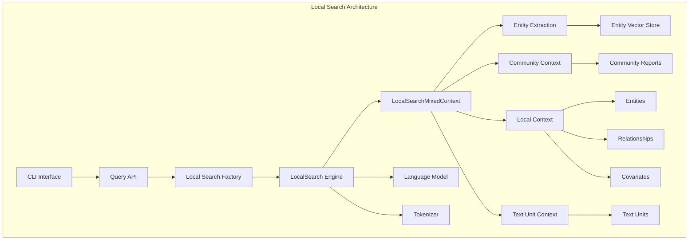
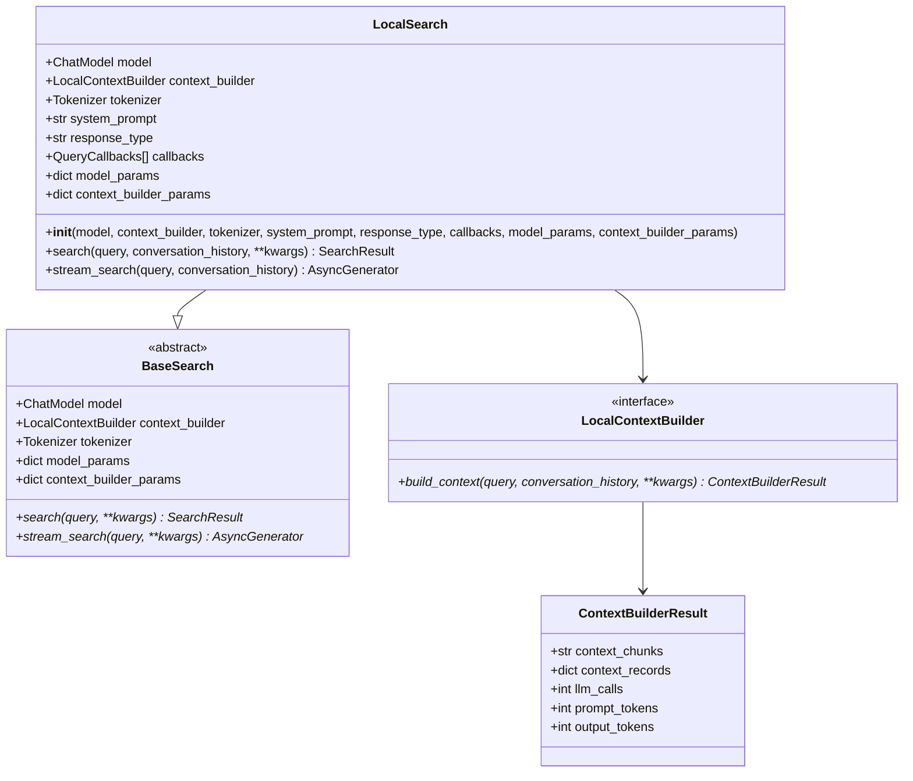
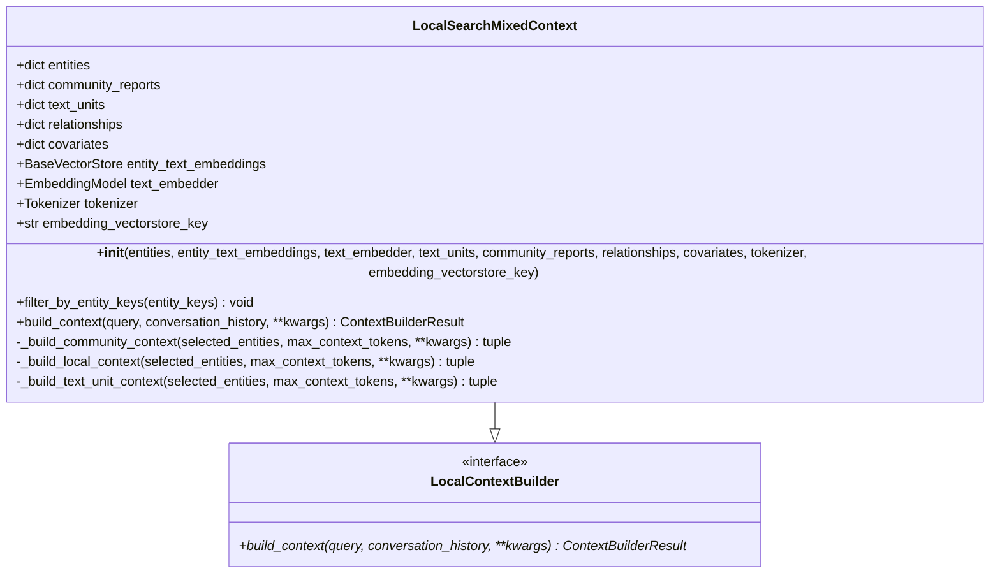
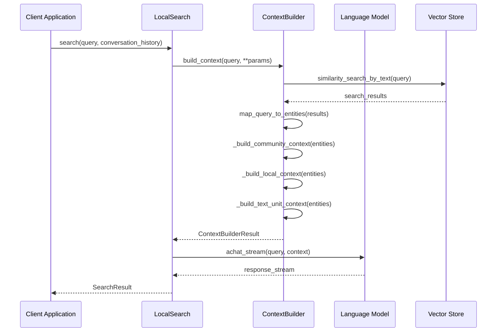
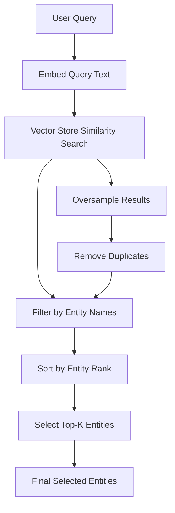
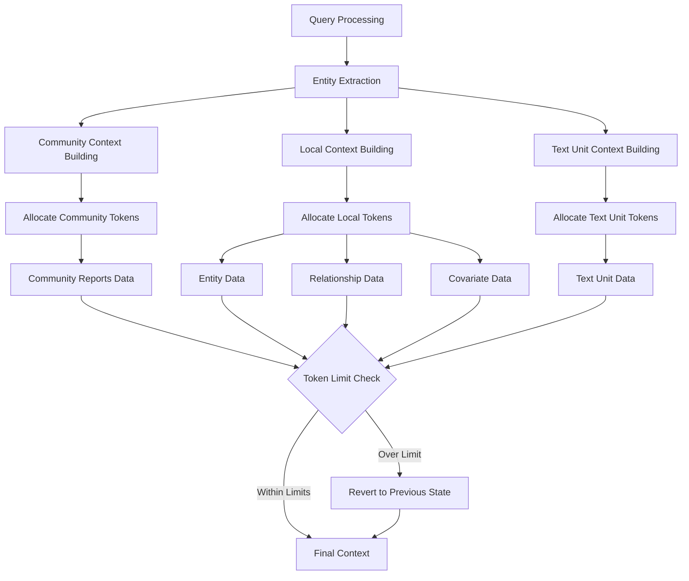
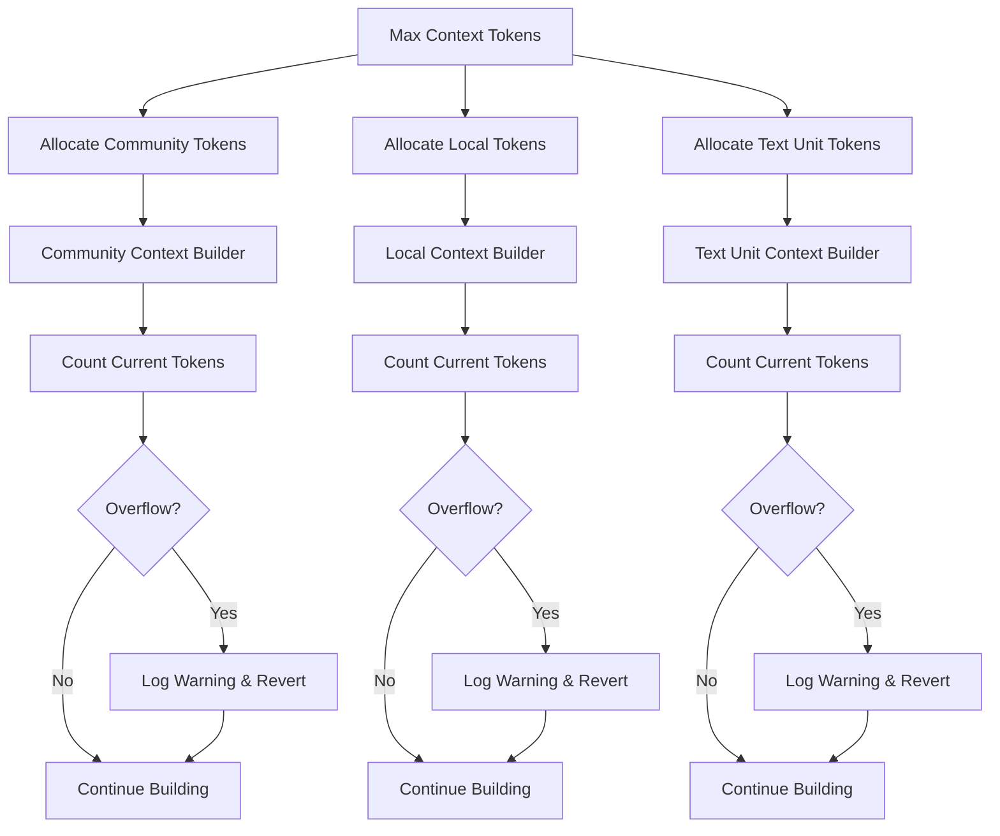
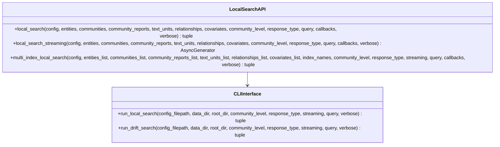
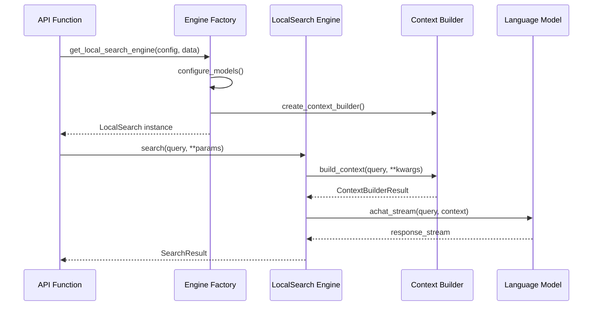

# Local Search

<cite>
**Referenced Files in This Document**
- [graphrag/query/structured_search/local_search/search.py](file://graphrag/query/structured_search/local_search/search.py)
- [graphrag/query/structured_search/local_search/mixed_context.py](file://graphrag/query/structured_search/local_search/mixed_context.py)
- [graphrag/query/context_builder/builders.py](file://graphrag/query/context_builder/builders.py)
- [graphrag/query/context_builder/local_context.py](file://graphrag/query/context_builder/local_context.py)
- [graphrag/query/context_builder/entity_extraction.py](file://graphrag/query/context_builder/entity_extraction.py)
- [graphrag/config/models/local_search_config.py](file://graphrag/config/models/local_search_config.py)
- [graphrag/config/defaults.py](file://graphrag/config/defaults.py)
- [graphrag/prompts/query/local_search_system_prompt.py](file://graphrag/prompts/query/local_search_system_prompt.py)
- [graphrag/query/factory.py](file://graphrag/query/factory.py)
- [graphrag/api/query.py](file://graphrag/api/query.py)
- [graphrag/cli/query.py](file://graphrag/cli/query.py)
- [unified-search-app/app/app_logic.py](file://unified-search-app/app/app_logic.py)
</cite>

## Table of Contents
1. [Introduction](#introduction)
2. [Architecture Overview](#architecture-overview)
3. [Core Components](#core-components)
4. [Domain Model](#domain-model)
5. [Implementation Details](#implementation-details)
6. [Context Building Process](#context-building-process)
7. [API Functions](#api-functions)
8. [Parameter Configuration](#parameter-configuration)
9. [Common Issues and Solutions](#common-issues-and-solutions)
10. [Examples and Usage](#examples-and-usage)
11. [Performance Considerations](#performance-considerations)
12. [Troubleshooting Guide](#troubleshooting-guide)

## Introduction

Local Search is a sophisticated search mechanism within GraphRAG that retrieves context from entities, relationships, community reports, and text units to provide focused, contextually relevant answers to user queries. Unlike global search, which operates across the entire knowledge graph, local search focuses on specific entities and their immediate context, making it ideal for targeted inquiries and detailed exploration of particular topics.

The Local Search system consists of two primary components: the `LocalSearch` class, which orchestrates the search process and generates responses, and the `LocalSearchMixedContext` builder, which intelligently combines different types of contextual data to create comprehensive search contexts.

## Architecture Overview

The Local Search architecture follows a modular design pattern with clear separation of concerns:



**Diagram sources**
- [graphrag/query/structured_search/local_search/search.py](file://graphrag/query/structured_search/local_search/search.py#L26-L164)
- [graphrag/query/structured_search/local_search/mixed_context.py](file://graphrag/query/structured_search/local_search/mixed_context.py#L50-L494)
- [graphrag/query/factory.py](file://graphrag/query/factory.py#L39-L108)

## Core Components

### LocalSearch Class

The `LocalSearch` class serves as the main orchestrator for local search operations, inheriting from `BaseSearch` and implementing the core search logic.



**Diagram sources**
- [graphrag/query/structured_search/local_search/search.py](file://graphrag/query/structured_search/local_search/search.py#L26-L164)
- [graphrag/query/context_builder/builders.py](file://graphrag/query/context_builder/builders.py#L40-L76)

**Section sources**
- [graphrag/query/structured_search/local_search/search.py](file://graphrag/query/structured_search/local_search/search.py#L26-L164)

### LocalSearchMixedContext Builder

The `LocalSearchMixedContext` class is responsible for building comprehensive search contexts by combining multiple data sources intelligently.



**Diagram sources**
- [graphrag/query/structured_search/local_search/mixed_context.py](file://graphrag/query/structured_search/local_search/mixed_context.py#L50-L494)

**Section sources**
- [graphrag/query/structured_search/local_search/mixed_context.py](file://graphrag/query/structured_search/local_search/mixed_context.py#L50-L494)

## Domain Model

The Local Search domain model defines several key parameters that control the search behavior and context composition:

### Core Parameters

| Parameter | Type | Default | Description |
|-----------|------|---------|-------------|
| `text_unit_prop` | float | 0.5 | Proportion of context allocated to text units (0.0-1.0) |
| `community_prop` | float | 0.25 | Proportion of context allocated to community reports (0.0-1.0) |
| `top_k_entities` | int | 10 | Number of top-k entities to consider for context |
| `top_k_relationships` | int | 10 | Number of top-k relationships to include per entity |
| `max_context_tokens` | int | 8000 | Maximum tokens allowed in the context window |
| `conversation_history_max_turns` | int | 5 | Maximum conversation history turns to include |

### Advanced Parameters

| Parameter | Type | Default | Description |
|-----------|------|---------|-------------|
| `include_entity_rank` | bool | True | Whether to include entity ranking in context |
| `include_relationship_weight` | bool | True | Whether to include relationship weights |
| `include_community_rank` | bool | False | Whether to include community ranking |
| `return_candidate_context` | bool | False | Whether to return candidate context data |
| `embedding_vectorstore_key` | str | "id" | Key type for entity vector store lookup |

**Section sources**
- [graphrag/config/models/local_search_config.py](file://graphrag/config/models/local_search_config.py#L11-L50)
- [graphrag/config/defaults.py](file://graphrag/config/defaults.py#L147-L156)

## Implementation Details

### Search Orchestration

The `LocalSearch` class implements a two-phase search process:

1. **Context Building Phase**: Uses `LocalSearchMixedContext` to construct comprehensive search context
2. **Response Generation Phase**: Sends the constructed context to the language model for response generation



**Diagram sources**
- [graphrag/query/structured_search/local_search/search.py](file://graphrag/query/structured_search/local_search/search.py#L51-L164)
- [graphrag/query/structured_search/local_search/mixed_context.py](file://graphrag/query/structured_search/local_search/mixed_context.py#L116-L222)

**Section sources**
- [graphrag/query/structured_search/local_search/search.py](file://graphrag/query/structured_search/local_search/search.py#L51-L164)

### Entity Extraction Process

The entity extraction process uses semantic similarity to identify relevant entities from the query:



**Diagram sources**
- [graphrag/query/context_builder/entity_extraction.py](file://graphrag/query/context_builder/entity_extraction.py#L37-L92)

**Section sources**
- [graphrag/query/context_builder/entity_extraction.py](file://graphrag/query/context_builder/entity_extraction.py#L37-L92)

## Context Building Process

### Multi-Source Context Assembly

The `LocalSearchMixedContext` builds context by combining four distinct data sources:

1. **Community Reports**: High-level summaries of communities containing selected entities
2. **Local Entities**: Individual entities with their descriptions and attributes
3. **Relationships**: Connections between entities with weights and descriptions
4. **Text Units**: Original source documents containing entity-related content



**Diagram sources**
- [graphrag/query/structured_search/local_search/mixed_context.py](file://graphrag/query/structured_search/local_search/mixed_context.py#L116-L222)

**Section sources**
- [graphrag/query/structured_search/local_search/mixed_context.py](file://graphrag/query/structured_search/local_search/mixed_context.py#L116-L222)

### Token Management and Overflow Handling

The system implements sophisticated token management to prevent context overflow:



**Diagram sources**
- [graphrag/query/structured_search/local_search/mixed_context.py](file://graphrag/query/structured_search/local_search/mixed_context.py#L448-L456)

**Section sources**
- [graphrag/query/structured_search/local_search/mixed_context.py](file://graphrag/query/structured_search/local_search/mixed_context.py#L448-L456)

## API Functions

### Local Search API

The Local Search API provides both synchronous and asynchronous interfaces for different use cases:



**Diagram sources**
- [graphrag/api/query.py](file://graphrag/api/query.py#L342-L495)
- [graphrag/cli/query.py](file://graphrag/cli/query.py#L136-L266)

**Section sources**
- [graphrag/api/query.py](file://graphrag/api/query.py#L342-L495)
- [graphrag/cli/query.py](file://graphrag/cli/query.py#L136-L266)

### Invocation Relationship

The relationship between API functions and the underlying search engine follows a clear pattern:

1. **API Layer**: Provides high-level interface with configuration management
2. **Factory Layer**: Creates and configures the search engine instances
3. **Engine Layer**: Executes the actual search operations
4. **Context Layer**: Builds and manages search contexts



**Diagram sources**
- [graphrag/query/factory.py](file://graphrag/query/factory.py#L39-L108)
- [graphrag/api/query.py](file://graphrag/api/query.py#L342-L495)

## Parameter Configuration

### Configuration Hierarchy

Local Search parameters are configured through multiple layers:

1. **Default Values**: Built-in sensible defaults
2. **Configuration Files**: YAML/JSON configuration files
3. **Command Line Overrides**: Runtime parameter overrides
4. **Programmatic Settings**: Direct API parameter specification

### Parameter Categories

#### Basic Configuration
- **Model Settings**: Chat model and embedding model selection
- **Response Format**: Desired response type and format
- **Output Control**: Verbose mode and callback configuration

#### Context Composition
- **Proportions**: `text_unit_prop`, `community_prop` allocation ratios
- **Entity Selection**: `top_k_entities`, `top_k_relationships` limits
- **Token Management**: `max_context_tokens` context window size

#### Advanced Options
- **Ranking Controls**: Entity and relationship ranking preferences
- **Community Settings**: Community report inclusion and ranking
- **History Management**: Conversation history handling

**Section sources**
- [graphrag/config/models/local_search_config.py](file://graphrag/config/models/local_search_config.py#L11-L50)
- [graphrag/config/defaults.py](file://graphrag/config/defaults.py#L147-L156)

## Common Issues and Solutions

### Context Overflow Issues

**Problem**: The generated context exceeds the maximum token limit, causing truncation or errors.

**Solution**: 
- Adjust the proportion parameters (`text_unit_prop`, `community_prop`) to allocate more space to essential content
- Reduce `top_k_entities` and `top_k_relationships` to decrease context size
- Increase `max_context_tokens` if the underlying model supports larger contexts

### Entity Ranking Problems

**Problem**: Entities selected for context don't match user expectations or aren't relevant.

**Solution**:
- Verify entity vector store configuration and embedding quality
- Adjust `oversample_scaler` parameter in entity extraction
- Use `include_entity_names` and `exclude_entity_names` filters
- Consider adjusting the `embedding_vectorstore_key` parameter

### Performance Optimization

**Problem**: Slow search response times affecting user experience.

**Solution**:
- Optimize vector store performance and indexing
- Reduce `max_context_tokens` for faster processing
- Enable streaming responses for immediate feedback
- Use appropriate caching strategies for repeated queries

### Memory Management

**Problem**: High memory usage during context building for large datasets.

**Solution**:
- Implement pagination for large entity/relationship sets
- Use sampling techniques for large text unit collections
- Monitor and adjust batch sizes for embedding operations
- Consider lazy loading for non-critical data components

## Examples and Usage

### Basic Local Search Usage

Here's how to perform a basic local search operation:

```python
# Example usage pattern from the codebase
response, context_data = await api.local_search(
    config=graphrag_config,
    entities=entities_df,
    communities=communities_df,
    community_reports=community_reports_df,
    text_units=text_units_df,
    relationships=relationships_df,
    covariates=covariates_df,
    community_level=community_level,
    response_type="Multiple Paragraphs",
    query="What are the key findings about climate change?",
)
```

### Streaming Search Implementation

For applications requiring real-time response generation:

```python
# Streaming implementation pattern
async def stream_local_search(query: str, config: GraphRagConfig):
    async for chunk in api.local_search_streaming(
        config=config,
        entities=entities,
        communities=communities,
        community_reports=community_reports,
        text_units=text_units,
        relationships=relationships,
        covariates=covariates,
        community_level=community_level,
        response_type="Multiple Paragraphs",
        query=query,
    ):
        yield chunk
```

### Multi-Index Search

For scenarios involving multiple knowledge bases:

```python
# Multi-index search pattern
response, context_data = await api.multi_index_local_search(
    config=config,
    entities_list=[entities1, entities2],
    communities_list=[communities1, communities2],
    community_reports_list=[reports1, reports2],
    text_units_list=[text_units1, text_units2],
    relationships_list=[relationships1, relationships2],
    covariates_list=[covariates1, covariates2],
    index_names=["index1", "index2"],
    community_level=community_level,
    response_type="Multiple Paragraphs",
    streaming=False,
    query="Compare the two datasets",
)
```

**Section sources**
- [graphrag/api/query.py](file://graphrag/api/query.py#L342-L495)
- [unified-search-app/app/app_logic.py](file://unified-search-app/app/app_logic.py#L148-L199)

## Performance Considerations

### Token Efficiency

The Local Search system implements several strategies to optimize token usage:

1. **Intelligent Proportion Allocation**: Dynamic distribution of context space based on content importance
2. **Incremental Context Building**: Gradual addition of context components until token limits are reached
3. **Candidate Context Filtering**: Efficient filtering of irrelevant context components

### Caching Strategies

Implement caching at multiple levels:

1. **Entity Embedding Cache**: Store computed embeddings to avoid recomputation
2. **Context Cache**: Cache frequently accessed context combinations
3. **Response Cache**: Store complete search results for identical queries

### Parallel Processing

The system supports concurrent operations:

1. **Parallel Entity Retrieval**: Simultaneous fetching of multiple entity contexts
2. **Asynchronous LLM Calls**: Non-blocking language model interactions
3. **Streaming Responses**: Real-time response generation without waiting for completion

## Troubleshooting Guide

### Debugging Context Issues

**Symptom**: Poor search quality or irrelevant results

**Diagnosis Steps**:
1. Check entity extraction accuracy using `return_candidate_context=True`
2. Verify vector store configuration and embedding quality
3. Review context proportions and token allocations
4. Examine conversation history impact

**Resolution Actions**:
- Adjust entity extraction parameters
- Fine-tune context composition ratios
- Clear and recompute entity embeddings
- Review and optimize vector store indexing

### Performance Troubleshooting

**Symptom**: Slow response times or timeouts

**Diagnostic Approach**:
1. Profile token counting operations
2. Monitor vector store query performance
3. Analyze context building bottlenecks
4. Check LLM call latency and throughput

**Optimization Strategies**:
- Reduce context size parameters
- Implement result caching
- Optimize vector store configuration
- Use streaming for large responses

### Configuration Validation

**Common Configuration Issues**:
- Invalid proportion sums exceeding 1.0
- Missing required model configurations
- Incorrect vector store key types
- Insufficient token limits for context size

**Validation Checklist**:
- Verify all required parameters are specified
- Check proportion constraints (community_prop + text_unit_prop ≤ 1.0)
- Validate model availability and credentials
- Confirm vector store connectivity and data presence

**Section sources**
- [graphrag/query/structured_search/local_search/mixed_context.py](file://graphrag/query/structured_search/local_search/mixed_context.py#L125-L129)