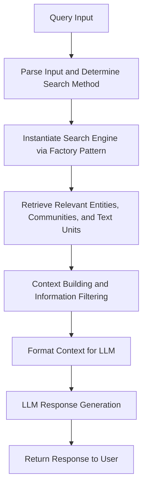
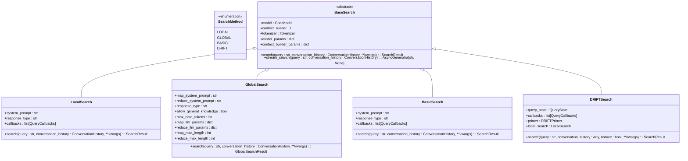
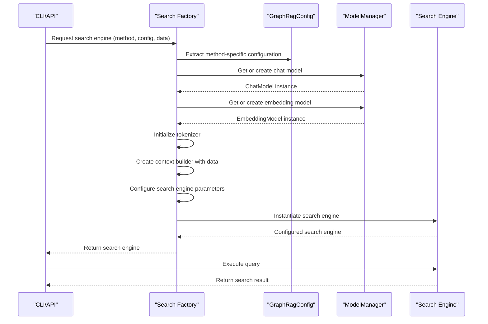
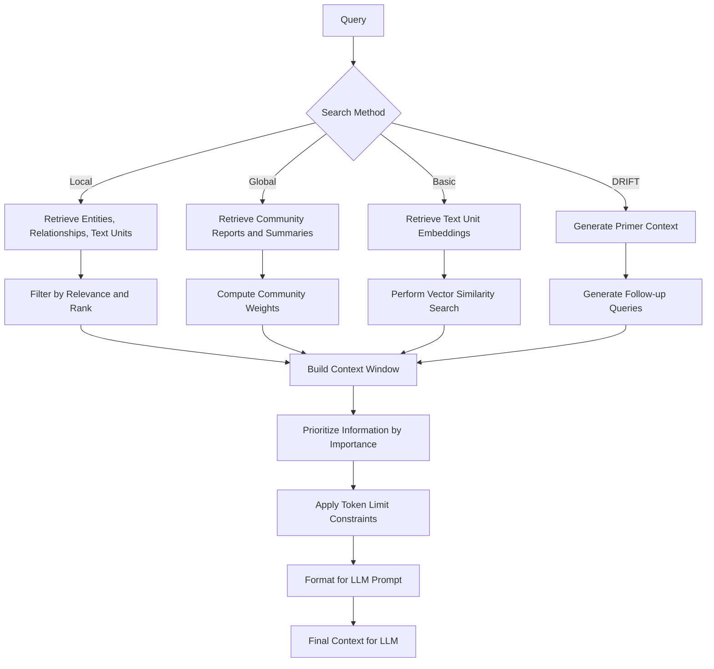
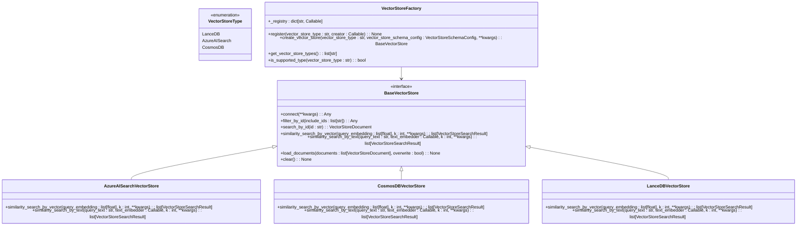

# Query System

<cite>
**Referenced Files in This Document**   
- [graphrag/query/factory.py](file://graphrag/query/factory.py)
- [graphrag/query/structured_search/base.py](file://graphrag/query/structured_search/base.py)
- [graphrag/query/structured_search/local_search/search.py](file://graphrag/query/structured_search/local_search/search.py)
- [graphrag/query/structured_search/global_search/search.py](file://graphrag/query/structured_search/global_search/search.py)
- [graphrag/query/structured_search/basic_search/search.py](file://graphrag/query/structured_search/basic_search/search.py)
- [graphrag/query/structured_search/drift_search/search.py](file://graphrag/query/structured_search/drift_search/search.py)
- [graphrag/query/context_builder/local_context.py](file://graphrag/query/context_builder/local_context.py)
- [graphrag/query/context_builder/community_context.py](file://graphrag/query/context_builder/community_context.py)
- [graphrag/vector_stores/factory.py](file://graphrag/vector_stores/factory.py)
- [graphrag/vector_stores/azure_ai_search.py](file://graphrag/vector_stores/azure_ai_search.py)
- [graphrag/cli/query.py](file://graphrag/cli/query.py)
- [graphrag/config/models/graph_rag_config.py](file://graphrag/config/models/graph_rag_config.py)
- [graphrag/config/models/drift_search_config.py](file://graphrag/config/models/drift_search_config.py)
</cite>

## Table of Contents
1. [Introduction](#introduction)
2. [Query Execution Flow](#query-execution-flow)
3. [Search Methodologies](#search-methodologies)
4. [Factory Pattern for Search Strategy Instantiation](#factory-pattern-for-search-strategy-instantiation)
5. [Context Builder and Information Retrieval](#context-builder-and-information-retrieval)
6. [Performance Characteristics and Caching](#performance-characteristics-and-caching)
7. [Vector Store Integration](#vector-store-integration)
8. [Choosing the Right Search Method](#choosing-the-right-search-method)

## Introduction
The GraphRAG Query System provides a unified interface for executing different search methodologies including local, global, basic, and DRIFT (Dynamic Recursive Iterative Filtering and Traversal) searches. This system enables users to retrieve relevant entities, communities, and text units to construct rich context for Large Language Model (LLM) response generation. The architecture is designed to support hybrid retrieval approaches, combining vector store capabilities with graph-based context building to deliver comprehensive and accurate responses to user queries.

**Section sources**
- [graphrag/query/factory.py](file://graphrag/query/factory.py#L1-L304)
- [graphrag/query/structured_search/base.py](file://graphrag/query/structured_search/base.py#L1-L93)

## Query Execution Flow
The query execution flow in GraphRAG follows a standardized process from input parsing to LLM response generation. When a query is received, the system first parses the input and determines the appropriate search methodology based on configuration. The query then proceeds through a context building phase where relevant entities, communities, and text units are retrieved and prioritized. This context is then formatted and passed to the LLM for response generation.

The execution flow begins with the CLI or API receiving a query, which is then routed to the appropriate search method based on the specified search type. The factory pattern instantiates the corresponding search engine, which orchestrates the retrieval of relevant data from the vector store and graph database. The context builder filters and prioritizes this information according to the search methodology, constructing a context window that fits within the LLM's token limits. Finally, the formatted context is sent to the LLM, which generates a response that is returned to the user.

**Diagram sources**
- [graphrag/cli/query.py](file://graphrag/cli/query.py#L1-L535)
- [graphrag/query/structured_search/base.py](file://graphrag/query/structured_search/base.py#L1-L93)

**Section sources**
- [graphrag/query/structured_search/base.py](file://graphrag/query/structured_search/base.py#L1-L93)
- [graphrag/cli/query.py](file://graphrag/cli/query.py#L1-L535)

## Search Methodologies
GraphRAG supports multiple search methodologies through a unified query interface, each designed for different use cases and information retrieval patterns.

### Local Search
Local search focuses on retrieving information from entities and relationships directly connected to the query. This method is optimized for detailed, entity-centric queries where the context is limited to a specific neighborhood within the knowledge graph. It retrieves relevant entities, relationships, and text units, building a context that emphasizes direct connections and immediate context.

### Global Search
Global search employs a two-step process involving map and reduce operations. In the map phase, the system performs parallel LLM calls on community summaries to generate intermediate answers. In the reduce phase, these intermediate answers are combined to produce a final comprehensive response. This approach is particularly effective for broad queries that require synthesizing information from multiple communities across the knowledge graph.

### Basic Search
Basic search implements a traditional RAG (Retrieval-Augmented Generation) approach, performing vector search directly on raw text chunks. This method bypasses the graph structure and relies solely on semantic similarity between the query and text embeddings. It is suitable for straightforward information retrieval tasks where graph relationships are less important than textual similarity.

### DRIFT Search
DRIFT (Dynamic Recursive Iterative Filtering and Traversal) search is an iterative approach that dynamically explores the knowledge graph. It begins with a primer phase to generate initial follow-up queries, then recursively processes these queries using local search as the underlying engine. The process continues for a configurable number of epochs, allowing the system to traverse multiple hops in the graph and gather increasingly relevant information. This method is ideal for complex queries that require deep exploration of interconnected entities and relationships.

**Diagram sources**
- [graphrag/query/structured_search/local_search/search.py](file://graphrag/query/structured_search/local_search/search.py#L1-L164)
- [graphrag/query/structured_search/global_search/search.py](file://graphrag/query/structured_search/global_search/search.py#L1-L496)
- [graphrag/query/structured_search/basic_search/search.py](file://graphrag/query/structured_search/basic_search/search.py#L1-L161)
- [graphrag/query/structured_search/drift_search/search.py](file://graphrag/query/structured_search/drift_search/search.py#L31-L253)

**Section sources**
- [graphrag/query/structured_search/local_search/search.py](file://graphrag/query/structured_search/local_search/search.py#L1-L164)
- [graphrag/query/structured_search/global_search/search.py](file://graphrag/query/structured_search/global_search/search.py#L1-L496)
- [graphrag/query/structured_search/basic_search/search.py](file://graphrag/query/structured_search/basic_search/search.py#L1-L161)
- [graphrag/query/structured_search/drift_search/search.py](file://graphrag/query/structured_search/drift_search/search.py#L31-L253)

## Factory Pattern for Search Strategy Instantiation
The GraphRAG system implements a factory pattern to instantiate different search strategies based on configuration. This design pattern provides a clean separation between the client code and the specific search implementations, allowing for flexible configuration and easy extension of new search methodologies.

The factory functions in `graphrag/query/factory.py` create the appropriate search engine based on the provided configuration and data. Each factory method, such as `get_local_search_engine`, `get_global_search_engine`, `get_basic_search_engine`, and `get_drift_search_engine`, handles the instantiation of the corresponding search class with all necessary dependencies. These methods extract configuration parameters, initialize language models, set up tokenizers, and configure the context builder with appropriate parameters before returning the fully configured search engine.

This factory approach enables the system to maintain a unified interface while supporting multiple search methodologies. The client code only needs to specify the desired search method, and the factory handles the complexity of creating the appropriate search engine with all required components properly configured.

**Diagram sources**
- [graphrag/query/factory.py](file://graphrag/query/factory.py#L1-L304)
- [graphrag/config/models/graph_rag_config.py](file://graphrag/config/models/graph_rag_config.py#L1-L417)

**Section sources**
- [graphrag/query/factory.py](file://graphrag/query/factory.py#L1-L304)

## Context Builder and Information Retrieval
The context builder plays a crucial role in filtering and prioritizing information for LLM response generation. It retrieves relevant entities, communities, and text units from the knowledge graph and constructs a context window that fits within the LLM's token limits while preserving the most important information.

For local search, the context builder retrieves entities, relationships, and covariates relevant to the query, formatting them into structured tables with appropriate headers and delimiters. It prioritizes information based on entity rank, relationship weight, and other configurable factors, ensuring that the most relevant context is included first. The builder also handles conversation history, incorporating previous interactions when appropriate.

For global search, the context builder processes community reports, organizing them into batches that can be processed in parallel. It computes community weights based on the number of text units associated with entities within each community, providing a measure of community importance. The builder also handles dynamic community selection, allowing the system to focus on the most relevant communities for a given query.

The DRIFT search context builder combines elements of both local and global approaches, using a primer phase to generate initial context and follow-up queries. It maintains a query state that tracks completed and pending actions, enabling the iterative exploration of the knowledge graph.

**Diagram sources**
- [graphrag/query/context_builder/local_context.py](file://graphrag/query/context_builder/local_context.py#L1-L358)
- [graphrag/query/context_builder/community_context.py](file://graphrag/query/context_builder/community_context.py#L1-L265)
- [graphrag/query/structured_search/drift_search/drift_context.py](file://graphrag/query/structured_search/drift_search/drift_context.py#L37-L64)

**Section sources**
- [graphrag/query/context_builder/local_context.py](file://graphrag/query/context_builder/local_context.py#L1-L358)
- [graphrag/query/context_builder/community_context.py](file://graphrag/query/context_builder/community_context.py#L1-L265)
- [graphrag/query/structured_search/drift_search/drift_context.py](file://graphrag/query/structured_search/drift_search/drift_context.py#L37-L64)

## Performance Characteristics and Caching
The GraphRAG Query System incorporates several performance optimizations to ensure efficient query processing and response generation. The system leverages caching at multiple levels to reduce redundant computations and improve response times.

Caching is implemented through the `graphrag/cache` module, which provides different cache backends including in-memory, file-based, and no-op implementations. The system caches expensive operations such as entity extraction, relationship retrieval, and embedding computations, allowing subsequent queries to benefit from previously computed results.

Performance characteristics vary by search methodology. Local search typically has the fastest response time as it operates on a limited neighborhood of the graph. Global search has higher latency due to its two-phase map-reduce approach but can handle broader queries. Basic search performance depends on the vector store's indexing and retrieval efficiency. DRIFT search has the highest computational cost due to its iterative nature but provides the most comprehensive exploration of the knowledge graph.

The system also implements rate limiting and retry mechanisms for LLM calls, preventing overwhelming the language model service and handling transient failures gracefully. Configuration parameters allow tuning of concurrency levels, token limits, and timeout settings to balance performance and reliability.

**Section sources**
- [graphrag/cache/factory.py](file://graphrag/cache/factory.py)
- [graphrag/language_model/providers/litellm/services/rate_limiter/rate_limiter_factory.py](file://graphrag/language_model/providers/litellm/services/rate_limiter/rate_limiter_factory.py)
- [graphrag/language_model/providers/litellm/services/retry/retry_factory.py](file://graphrag/language_model/providers/litellm/services/retry/retry_factory.py)

## Vector Store Integration
GraphRAG integrates with vector stores for hybrid retrieval, combining the strengths of semantic search with graph-based context building. The system supports multiple vector store implementations through a factory pattern, including Azure AI Search, CosmosDB, and LanceDB.

The vector store integration enables efficient similarity search on text embeddings, allowing the system to retrieve relevant text units based on semantic similarity to the query. This capability is particularly important for basic search and as a component of other search methodologies. The context builder uses vector similarity search to identify relevant text units, which are then incorporated into the context window along with graph-based information.

The integration is configured through the `vector_store_config` in the GraphRAG configuration, specifying the vector store type, connection parameters, and schema configuration. The factory pattern in `graphrag/vector_stores/factory.py` creates the appropriate vector store instance based on the configuration, providing a consistent interface regardless of the underlying implementation.

**Diagram sources**
- [graphrag/vector_stores/factory.py](file://graphrag/vector_stores/factory.py#L1-L97)
- [graphrag/vector_stores/azure_ai_search.py](file://graphrag/vector_stores/azure_ai_search.py)
- [graphrag/vector_stores/cosmosdb.py](file://graphrag/vector_stores/cosmosdb.py)
- [graphrag/vector_stores/lancedb.py](file://graphrag/vector_stores/lancedb.py)

**Section sources**
- [graphrag/vector_stores/factory.py](file://graphrag/vector_stores/factory.py#L1-L97)
- [graphrag/index/operations/embed_text/embed_text.py](file://graphrag/index/operations/embed_text/embed_text.py#L72-L217)

## Choosing the Right Search Method
Selecting the appropriate search method depends on the specific use case, query characteristics, and performance requirements. Each search methodology has strengths that make it suitable for particular scenarios.

Use **Local Search** when:
- The query focuses on specific entities and their immediate relationships
- Detailed information about a particular domain or entity is needed
- Fast response times are critical
- The context should be limited to a specific neighborhood in the knowledge graph

Use **Global Search** when:
- The query requires synthesizing information from multiple communities
- Broad, comprehensive answers are needed
- The answer may span multiple domains or topics
- Parallel processing can be leveraged to improve performance

Use **Basic Search** when:
- Traditional semantic search on raw text is sufficient
- The graph structure is less important than textual similarity
- Simple information retrieval tasks are required
- Integration with existing RAG systems is needed

Use **DRIFT Search** when:
- Complex queries require deep exploration of interconnected entities
- Iterative refinement of the search is beneficial
- The answer may require traversing multiple hops in the knowledge graph
- Comprehensive coverage of related information is important

The choice of search method should consider the trade-offs between comprehensiveness, accuracy, and performance. Local and basic searches typically offer faster response times, while global and DRIFT searches provide more comprehensive results at the cost of higher computational requirements.

**Section sources**
- [graphrag/query/factory.py](file://graphrag/query/factory.py#L1-L304)
- [graphrag/config/models/graph_rag_config.py](file://graphrag/config/models/graph_rag_config.py#L1-L417)
- [graphrag/cli/main.py](file://graphrag/cli/main.py#L500-L545)