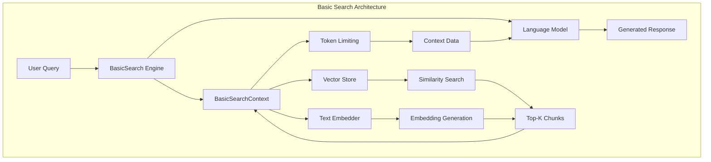
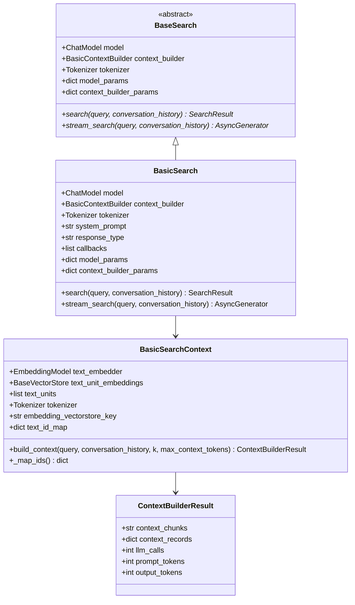
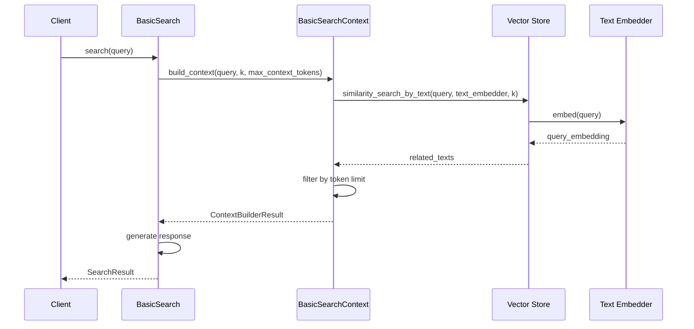
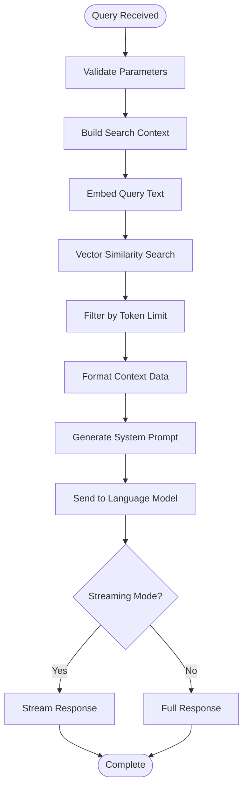
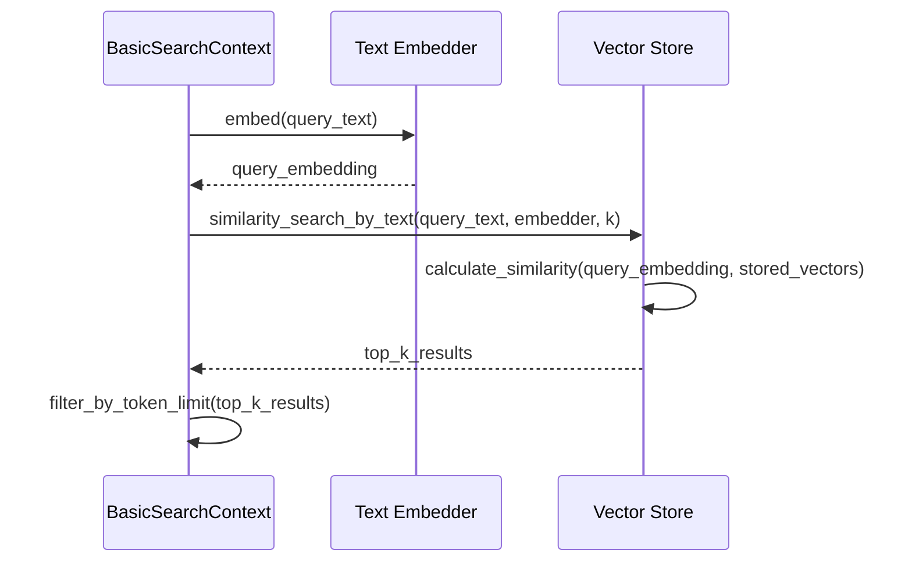

# Basic Search

<cite>
**Referenced Files in This Document**
- [search.py](file://graphrag/query/structured_search/basic_search/search.py)
- [basic_context.py](file://graphrag/query/structured_search/basic_search/basic_context.py)
- [basic_search_config.py](file://graphrag/config/models/basic_search_config.py)
- [factory.py](file://graphrag/query/factory.py)
- [basic_search_system_prompt.py](file://graphrag/prompts/query/basic_search_system_prompt.py)
- [base.py](file://graphrag/query/structured_search/base.py)
- [builders.py](file://graphrag/query/context_builder/builders.py)
- [defaults.py](file://graphrag/config/defaults.py)
- [indexer_adapters.py](file://graphrag/query/indexer_adapters.py)
</cite>

## Table of Contents
1. [Introduction](#introduction)
2. [Architecture Overview](#architecture-overview)
3. [Core Components](#core-components)
4. [Configuration Options](#configuration-options)
5. [Implementation Details](#implementation-details)
6. [Query Execution Flow](#query-execution-flow)
7. [Vector Store Integration](#vector-store-integration)
8. [Performance Considerations](#performance-considerations)
9. [Usage Examples](#usage-examples)
10. [Best Practices](#best-practices)
11. [Troubleshooting](#troubleshooting)

## Introduction

Basic Search is GraphRAG's fundamental vector similarity search feature that provides a simple yet powerful approach to retrieving relevant text chunks from a collection of documents. Unlike graph-enhanced search methods that leverage the knowledge graph structure, Basic Search operates purely on vector embeddings of text units, making it ideal for straightforward information retrieval tasks.

The feature implements a generic RAG (Retrieval-Augmented Generation) algorithm that combines vector similarity search with LLM-powered response generation. It's designed to be lightweight, efficient, and accessible for both beginners and experienced developers.

## Architecture Overview

Basic Search follows a modular architecture that separates concerns between search orchestration, context building, and response generation:



**Diagram sources**
- [search.py](file://graphrag/query/structured_search/basic_search/search.py#L27-L161)
- [basic_context.py](file://graphrag/query/structured_search/basic_search/basic_context.py#L25-L114)

**Section sources**
- [search.py](file://graphrag/query/structured_search/basic_search/search.py#L1-L161)
- [basic_context.py](file://graphrag/query/structured_search/basic_search/basic_context.py#L1-L114)

## Core Components

### BasicSearch Class

The `BasicSearch` class serves as the main orchestrator for the basic search functionality. It inherits from `BaseSearch` and provides the core search capabilities:



**Diagram sources**
- [base.py](file://graphrag/query/structured_search/base.py#L55-L93)
- [search.py](file://graphrag/query/structured_search/basic_search/search.py#L27-L61)
- [basic_context.py](file://graphrag/query/structured_search/basic_search/basic_context.py#L25-L114)

### BasicSearchContext Class

The `BasicSearchContext` class handles the context building process, which involves:

1. **Vector Similarity Search**: Finding relevant text chunks based on query embeddings
2. **Token Limiting**: Ensuring the context fits within the LLM's token limits
3. **Data Formatting**: Converting results into a format suitable for the LLM

**Section sources**
- [search.py](file://graphrag/query/structured_search/basic_search/search.py#L27-L161)
- [basic_context.py](file://graphrag/query/structured_search/basic_search/basic_context.py#L25-L114)

## Configuration Options

Basic Search provides several configuration parameters through the `BasicSearchConfig` class:

| Parameter | Type | Default | Description |
|-----------|------|---------|-------------|
| `prompt` | str \| None | None | Custom system prompt for the search engine |
| `chat_model_id` | str | "default_chat_model" | ID of the chat model to use |
| `embedding_model_id` | str | "default_embedding_model" | ID of the embedding model to use |
| `k` | int | 10 | Number of text units to retrieve for context |
| `max_context_tokens` | int | 12,000 | Maximum tokens allowed in the search context |

### Configuration Example

```python
from graphrag.config.models.basic_search_config import BasicSearchConfig

config = BasicSearchConfig(
    k=15,  # Retrieve 15 text units
    max_context_tokens=8000,  # Limit context to 8k tokens
    chat_model_id="gpt-4",
    embedding_model_id="text-embedding-3-small"
)
```

**Section sources**
- [basic_search_config.py](file://graphrag/config/models/basic_search_config.py#L11-L34)
- [defaults.py](file://graphrag/config/defaults.py#L76-L84)

## Implementation Details

### BasicSearchContextBuilder Implementation

The `BasicSearchContext` class implements the `BasicContextBuilder` interface and provides the core functionality for building search contexts:



**Diagram sources**
- [search.py](file://graphrag/query/structured_search/basic_search/search.py#L52-L161)
- [basic_context.py](file://graphrag/query/structured_search/basic_search/basic_context.py#L43-L106)

### Key Implementation Features

1. **Dynamic Token Management**: Automatically adjusts the number of retrieved chunks based on token limits
2. **Flexible Embedding Models**: Supports various embedding providers through the `EmbeddingModel` interface
3. **Vector Store Abstraction**: Works with any vector store implementation through the `BaseVectorStore` interface

**Section sources**
- [basic_context.py](file://graphrag/query/structured_search/basic_search/basic_context.py#L43-L106)

## Query Execution Flow

The query execution follows a well-defined flow that ensures optimal performance and accuracy:



**Diagram sources**
- [search.py](file://graphrag/query/structured_search/basic_search/search.py#L52-L161)

### Step-by-Step Process

1. **Parameter Validation**: Validates input parameters and configuration
2. **Context Building**: Retrieves relevant text chunks using vector similarity
3. **Token Management**: Ensures the context fits within the LLM's token limits
4. **Prompt Generation**: Formats the system prompt with context data
5. **Response Generation**: Sends the query and context to the LLM for response generation

**Section sources**
- [search.py](file://graphrag/query/structured_search/basic_search/search.py#L52-L161)

## Vector Store Integration

Basic Search integrates seamlessly with various vector stores through the `BaseVectorStore` interface:

### Supported Vector Stores

- **Azure AI Search**: Enterprise-grade vector search with hybrid capabilities
- **Cosmos DB**: Azure's globally distributed database with vector search
- **LanceDB**: Open-source vector database optimized for ML workloads
- **Custom Implementations**: Any vector store implementing the `BaseVectorStore` interface

### Vector Store Operations

The `BasicSearchContext` utilizes several key vector store operations:

| Operation | Purpose | Parameters |
|-----------|---------|------------|
| `similarity_search_by_text` | Find similar documents | text, text_embedder, k |
| `search_by_id` | Retrieve document by ID | id |
| `similarity_search_by_vector` | Vector-based similarity search | query_embedding, k |

### Embedding Workflow



**Diagram sources**
- [basic_context.py](file://graphrag/query/structured_search/basic_search/basic_context.py#L56-L68)

**Section sources**
- [basic_context.py](file://graphrag/query/structured_search/basic_search/basic_context.py#L56-L68)

## Performance Considerations

### Semantic Drift Mitigation

Semantic drift occurs when the meaning of text changes during the embedding process. Basic Search addresses this through:

1. **Consistent Embedding Models**: Using the same embedding model for both indexing and querying
2. **Quality Embeddings**: Leveraging high-quality embedding models like OpenAI's text-embedding-3-small
3. **Context Filtering**: Carefully selecting relevant chunks to minimize irrelevant information

### Large Document Collection Optimization

For large document collections, consider these optimizations:

1. **Batch Processing**: Process embeddings in batches to improve throughput
2. **Index Partitioning**: Partition large datasets across multiple vector stores
3. **Caching**: Implement caching mechanisms for frequently accessed embeddings
4. **Parallel Processing**: Utilize concurrent requests for embedding generation

### Memory and Computational Efficiency

- **Token Limiting**: Automatic truncation prevents excessive memory usage
- **Lazy Loading**: Load only necessary text units into memory
- **Streaming Responses**: Support for streaming reduces initial latency

**Section sources**
- [basic_context.py](file://graphrag/query/structured_search/basic_search/basic_context.py#L76-L106)

## Usage Examples

### Basic Search Initialization

```python
from graphrag.query.factory import get_basic_search_engine
from graphrag.query.input.loaders.dfs import read_text_units
from graphrag.vector_stores.factory import create_vector_store

# Initialize vector store
vector_store = create_vector_store(
    type="lancedb",
    config={
        "uri": "./vector_db",
        "table_name": "text_units"
    }
)

# Load text units
text_units_df = pd.read_csv("text_units.csv")
text_units = read_text_units(text_units_df)

# Get basic search engine
search_engine = get_basic_search_engine(
    text_units=text_units,
    text_unit_embeddings=vector_store,
    config=graphrag_config,
    response_type="multiple paragraphs"
)
```

### Performing a Search

```python
# Simple search
response, context_data = await search_engine.search(
    query="What are the key findings about climate change?"
)

# Streaming search
async for chunk in search_engine.stream_search(
    query="Explain the research methodology"
):
    print(chunk, end="")
```

### Advanced Configuration

```python
from graphrag.config.models.basic_search_config import BasicSearchConfig

# Custom configuration
config = BasicSearchConfig(
    k=20,  # More context chunks
    max_context_tokens=15000,  # Larger context window
    chat_model_id="gpt-4",
    embedding_model_id="text-embedding-3-large"
)

# Initialize with custom config
search_engine = get_basic_search_engine(
    text_units=text_units,
    text_unit_embeddings=vector_store,
    config=config,
    system_prompt="Provide detailed technical answers.",
    response_type="bullet points"
)
```

**Section sources**
- [factory.py](file://graphrag/query/factory.py#L249-L303)

## Best Practices

### When to Use Basic Search

**Use Basic Search when:**
- You need simple, fast information retrieval
- The knowledge graph structure isn't relevant to your queries
- You want a lightweight solution without graph overhead
- Your documents are primarily text-based with clear semantic relationships

**Avoid Basic Search when:**
- You need to leverage entity relationships and graph structure
- Queries require deep knowledge graph traversal
- You need to combine multiple knowledge sources intelligently

### Optimization Guidelines

1. **Embedding Model Selection**: Choose embedding models appropriate for your domain
2. **Context Size Tuning**: Balance `k` and `max_context_tokens` for optimal performance
3. **Vector Store Configuration**: Optimize vector store settings for your dataset size
4. **Caching Strategy**: Implement caching for frequently accessed documents

### Quality Assurance

1. **Embedding Consistency**: Use the same embedding model for indexing and querying
2. **Context Relevance**: Monitor and adjust `k` parameter based on relevance metrics
3. **Token Management**: Regularly review token usage patterns
4. **Performance Monitoring**: Track search latency and accuracy metrics

## Troubleshooting

### Common Issues and Solutions

#### Issue: Poor Search Relevance
**Symptoms**: Irrelevant or low-quality search results
**Solutions**:
- Increase the `k` parameter to retrieve more candidates
- Verify embedding model quality and consistency
- Check vector store indexing quality
- Review query preprocessing steps

#### Issue: High Latency
**Symptoms**: Slow response times
**Solutions**:
- Reduce `max_context_tokens` to limit context size
- Optimize vector store configuration
- Implement caching for embeddings
- Use faster embedding models

#### Issue: Token Limit Exceeded
**Symptoms**: Truncated responses or context errors
**Solutions**:
- Decrease `max_context_tokens` parameter
- Reduce `k` to limit retrieved chunks
- Implement smarter context filtering
- Use more efficient token counting

#### Issue: Memory Issues
**Symptoms**: Out of memory errors or slow performance
**Solutions**:
- Implement batch processing for large datasets
- Use streaming responses when possible
- Optimize vector store memory usage
- Consider data partitioning

### Debugging Tools

1. **Logging**: Enable debug logging to track search execution
2. **Metrics**: Monitor token usage, response times, and accuracy
3. **Visualization**: Use the unified search app for interactive debugging
4. **Testing**: Implement unit tests for search functionality

**Section sources**
- [search.py](file://graphrag/query/structured_search/basic_search/search.py#L114-L127)
- [basic_context.py](file://graphrag/query/structured_search/basic_search/basic_context.py#L86-L88)