# DRIFT Search

<cite>
**Referenced Files in This Document**
- [search.py](file://graphrag/query/structured_search/drift_search/search.py)
- [primer.py](file://graphrag/query/structured_search/drift_search/primer.py)
- [action.py](file://graphrag/query/structured_search/drift_search/action.py)
- [state.py](file://graphrag/query/structured_search/drift_search/state.py)
- [drift_context.py](file://graphrag/query/structured_search/drift_search/drift_context.py)
- [drift_search_config.py](file://graphrag/config/models/drift_search_config.py)
- [drift_search_system_prompt.py](file://graphrag/prompts/query/drift_search_system_prompt.py)
- [local_search/search.py](file://graphrag/query/structured_search/local_search/search.py)
- [base.py](file://graphrag/query/structured_search/base.py)
</cite>

## Table of Contents
1. [Introduction](#introduction)
2. [Architecture Overview](#architecture-overview)
3. [Core Components](#core-components)
4. [DRIFTPrimer Implementation](#driftprimer-implementation)
5. [Recursive Execution Loop](#recursive-execution-loop)
6. [Configuration Options](#configuration-options)
7. [Parallel Search Operations](#parallel-search-operations)
8. [State Management](#state-management)
9. [Integration with Local Search](#integration-with-local-search)
10. [Common Issues and Solutions](#common-issues-and-solutions)
11. [Performance Optimization](#performance-optimization)
12. [Usage Examples](#usage-examples)

## Introduction

DRIFT (Dynamic Recursive Iterative Fusion Tree) Search is a sophisticated knowledge graph exploration technique in GraphRAG that employs an iterative, multi-hop approach to discover comprehensive answers. Unlike traditional search methods that rely on single-pass retrieval, DRIFT performs recursive decomposition and fusion of queries, generating follow-up questions to progressively refine and expand the search space.

The DRIFT algorithm operates through a three-phase process: **priming**, **iteration**, and **reduction**. During priming, it generates initial actions and follow-up queries based on community reports. In the iteration phase, it executes these actions recursively, exploring the knowledge graph through multiple hops. Finally, it reduces the accumulated results into a coherent, comprehensive response.

## Architecture Overview

DRIFT Search implements a hierarchical architecture that combines global guidance from community reports with local search capabilities:

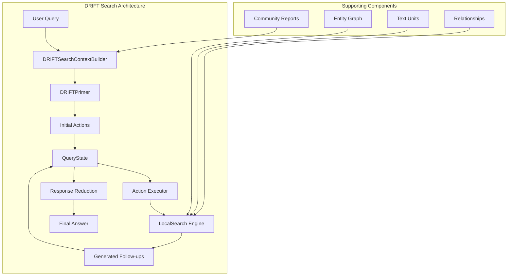

**Diagram sources**
- [search.py](file://graphrag/query/structured_search/drift_search/search.py#L34-L67)
- [drift_context.py](file://graphrag/query/structured_search/drift_search/drift_context.py#L37-L80)

The architecture emphasizes modularity and extensibility, with clear separation between context building, action management, and search execution.

**Section sources**
- [search.py](file://graphrag/query/structured_search/drift_search/search.py#L34-L67)
- [drift_context.py](file://graphrag/query/structured_search/drift_search/drift_context.py#L37-L80)

## Core Components

### DRIFTSearch Class

The `DRIFTSearch` class serves as the main orchestrator for the DRIFT algorithm, inheriting from `BaseSearch` and managing the complete search lifecycle:

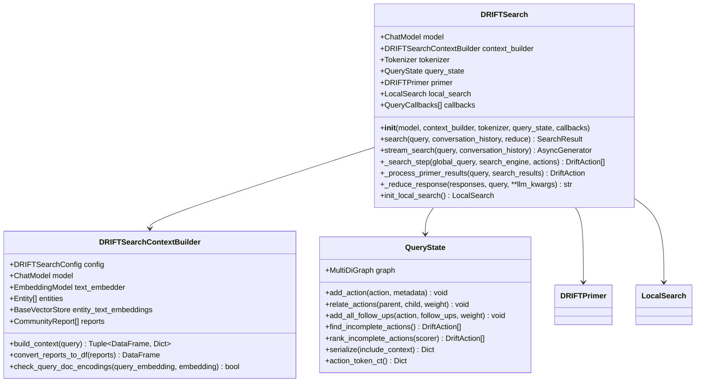

**Diagram sources**
- [search.py](file://graphrag/query/structured_search/drift_search/search.py#L34-L67)
- [drift_context.py](file://graphrag/query/structured_search/drift_search/drift_context.py#L37-L80)
- [state.py](file://graphrag/query/structured_search/drift_search/state.py#L18-L50)

### DriftAction Class

Each `DriftAction` represents a discrete unit of work in the DRIFT algorithm, encapsulating a query, its answer, scoring information, and follow-up actions:

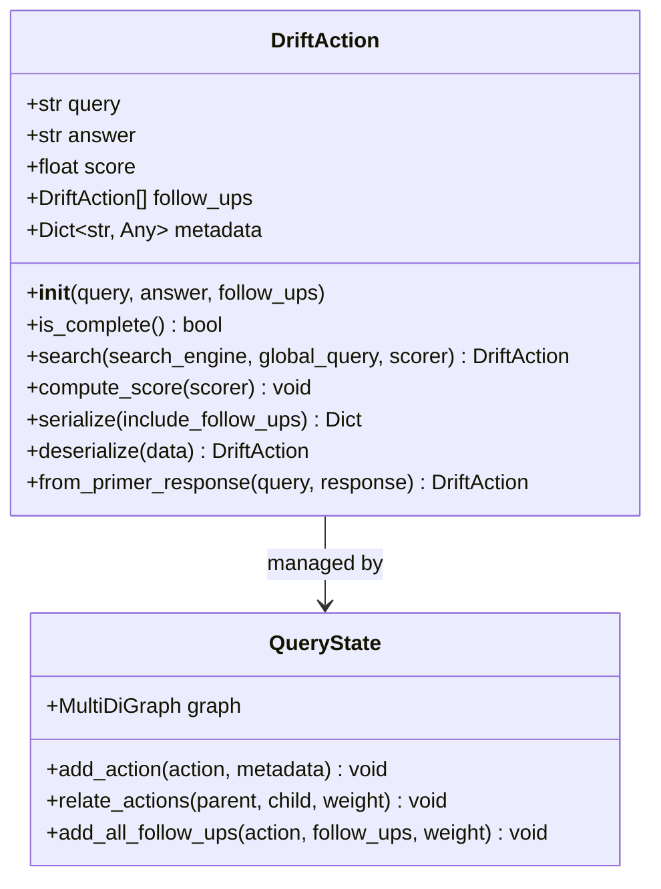

**Diagram sources**
- [action.py](file://graphrag/query/structured_search/drift_search/action.py#L15-L50)
- [state.py](file://graphrag/query/structured_search/drift_search/state.py#L18-L50)

**Section sources**
- [search.py](file://graphrag/query/structured_search/drift_search/search.py#L34-L67)
- [action.py](file://graphrag/query/structured_search/drift_search/action.py#L15-L50)
- [state.py](file://graphrag/query/structured_search/drift_search/state.py#L18-L50)

## DRIFTPrimer Implementation

The `DRIFTPrimer` serves as the initial query decomposition mechanism, leveraging community reports to generate strategic follow-up queries and intermediate answers.

### Primer Query Processing

The `PrimerQueryProcessor` handles the expansion of user queries using community report templates:

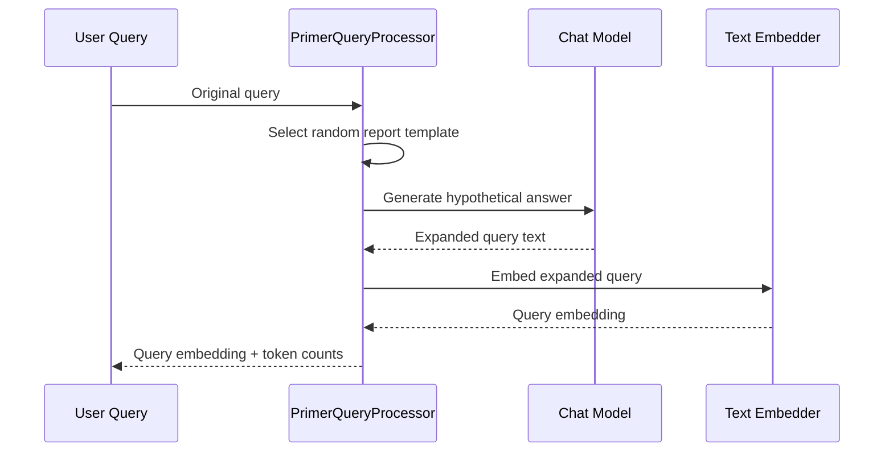

**Diagram sources**
- [primer.py](file://graphrag/query/structured_search/drift_search/primer.py#L28-L99)

### Query Decomposition

The `DRIFTPrimer` decomposes queries into structured subqueries using community report insights:

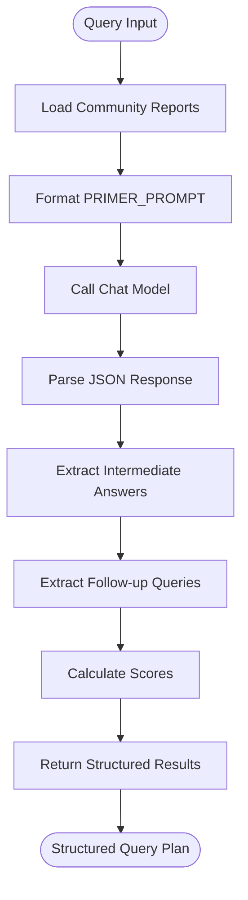

**Diagram sources**
- [primer.py](file://graphrag/query/structured_search/drift_search/primer.py#L101-L152)

### Parallel Report Processing

The primer supports parallel processing through configurable folding:

| Parameter | Description | Default Value | Impact |
|-----------|-------------|---------------|---------|
| `primer_folds` | Number of parallel processing folds | 1 | Higher values enable more parallelism |
| `drift_k_followups` | Top-k reports to process | 50 | Controls parallel workload |

**Section sources**
- [primer.py](file://graphrag/query/structured_search/drift_search/primer.py#L101-L202)
- [drift_search_system_prompt.py](file://graphrag/prompts/query/drift_search_system_prompt.py#L139-L168)

## Recursive Execution Loop

The core of DRIFT lies in its recursive execution loop, which iteratively processes incomplete actions until convergence or depth limits are reached.

### Epoch-Based Iteration

The main execution loop operates on epochs, each processing a batch of incomplete actions:

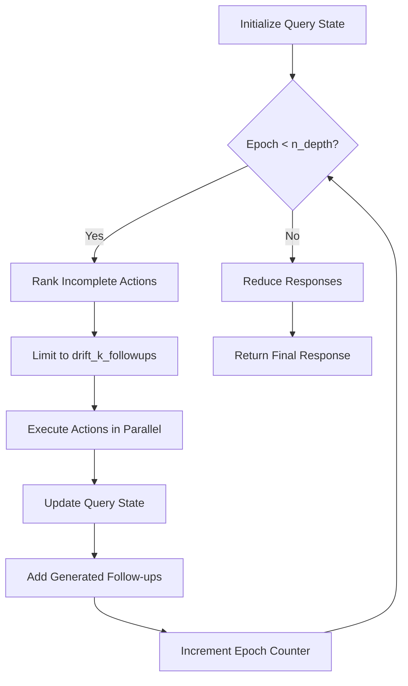

**Diagram sources**
- [search.py](file://graphrag/query/structured_search/drift_search/search.py#L230-L251)

### Action Ranking and Selection

The system employs intelligent action ranking based on scores:

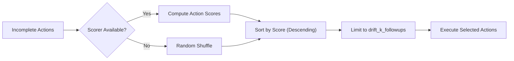

**Diagram sources**
- [state.py](file://graphrag/query/structured_search/drift_search/state.py#L55-L77)

### Concurrency Control

The `_search_step` method orchestrates parallel execution of actions:

| Aspect | Implementation | Purpose |
|--------|----------------|---------|
| Task Creation | List comprehension with `action.search()` | Creates parallel tasks |
| Execution | `tqdm_asyncio.gather()` | Executes tasks concurrently |
| Progress Tracking | `leave=False` parameter | Maintains clean progress display |
| Error Handling | Graceful failure propagation | Prevents single failures from stopping entire process |

**Section sources**
- [search.py](file://graphrag/query/structured_search/drift_search/search.py#L158-L178)
- [state.py](file://graphrag/query/structured_search/drift_search/state.py#L55-L77)

## Configuration Options

The DRIFT search system provides extensive configuration through `DRIFTSearchConfig`:

### Core Configuration Parameters

| Parameter | Type | Description | Default | Impact |
|-----------|------|-------------|---------|---------|
| `n_depth` | int | Maximum recursion depth | 3 | Controls search breadth |
| `drift_k_followups` | int | Parallel query limit per epoch | 50 | Affects concurrency |
| `primer_folds` | int | Parallel processing folds | 1 | Enables parallel decomposition |
| `concurrency` | int | Concurrent request limit | 5 | Controls LLM usage |

### Local Search Integration

| Parameter | Type | Description | Default | Purpose |
|-----------|------|-------------|---------|---------|
| `local_search_text_unit_prop` | float | Text unit context proportion | 0.5 | Balances context types |
| `local_search_community_prop` | float | Community context proportion | 0.5 | Balances context types |
| `local_search_max_data_tokens` | int | Maximum context tokens | 12000 | Controls context size |
| `local_search_temperature` | float | Generation temperature | 0.0 | Controls creativity |

### Response Processing

| Parameter | Type | Description | Default | Purpose |
|-----------|------|-------------|---------|---------|
| `reduce_max_tokens` | int | Response reduction tokens | 2000 | Controls final response size |
| `reduce_temperature` | float | Reduction temperature | 0.0 | Ensures consistency |
| `primer_llm_max_tokens` | int | Primer generation limit | 2000 | Controls primer quality |

**Section sources**
- [drift_search_config.py](file://graphrag/config/models/drift_search_config.py#L11-L124)

## Parallel Search Operations

### _search_step Method

The `_search_step` method exemplifies DRIFT's parallel execution strategy:

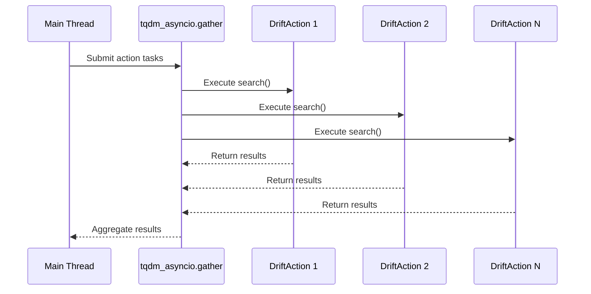

**Diagram sources**
- [search.py](file://graphrag/query/structured_search/drift_search/search.py#L158-L178)

### Concurrency Benefits

Parallel execution provides several advantages:

1. **Reduced Latency**: Multiple actions execute simultaneously
2. **Improved Throughput**: Better utilization of LLM resources
3. **Fault Isolation**: Single action failures don't block others
4. **Scalable Scaling**: Linear scaling with available resources

### Concurrency Control Mechanisms

| Mechanism | Implementation | Purpose |
|-----------|----------------|---------|
| Task Limiting | `drift_k_followups` parameter | Prevents resource exhaustion |
| Progress Tracking | `tqdm_asyncio` wrapper | Monitors execution progress |
| Error Propagation | Graceful exception handling | Maintains system stability |

**Section sources**
- [search.py](file://graphrag/query/structured_search/drift_search/search.py#L158-L178)

## State Management

### QueryState Architecture

The `QueryState` class manages the complete search state using a directed multigraph:

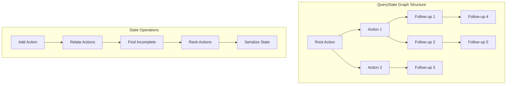

**Diagram sources**
- [state.py](file://graphrag/query structured_search/drift_search/state.py#L18-L50)

### State Persistence and Serialization

The state management supports comprehensive serialization for persistence and debugging:

| Operation | Method | Purpose |
|-----------|--------|---------|
| Add Action | `add_action()` | Insert new actions into graph |
| Relate Actions | `relate_actions()` | Establish parent-child relationships |
| Find Incomplete | `find_incomplete_actions()` | Identify pending work |
| Rank Actions | `rank_incomplete_actions()` | Prioritize execution order |
| Serialize | `serialize()` | Export state for persistence |

### Graph-Based State Representation

The use of NetworkX's MultiDiGraph provides several benefits:

1. **Rich Relationships**: Supports multiple edges between nodes
2. **Flexible Queries**: Enables complex graph traversals
3. **Persistent Storage**: Easy serialization to JSON format
4. **Debugging Support**: Visualizable state representation

**Section sources**
- [state.py](file://graphrag/query/structured_search/drift_search/state.py#L18-L151)

## Integration with Local Search

### LocalSearch Engine Initialization

The DRIFT system initializes a specialized `LocalSearch` engine for executing individual actions:

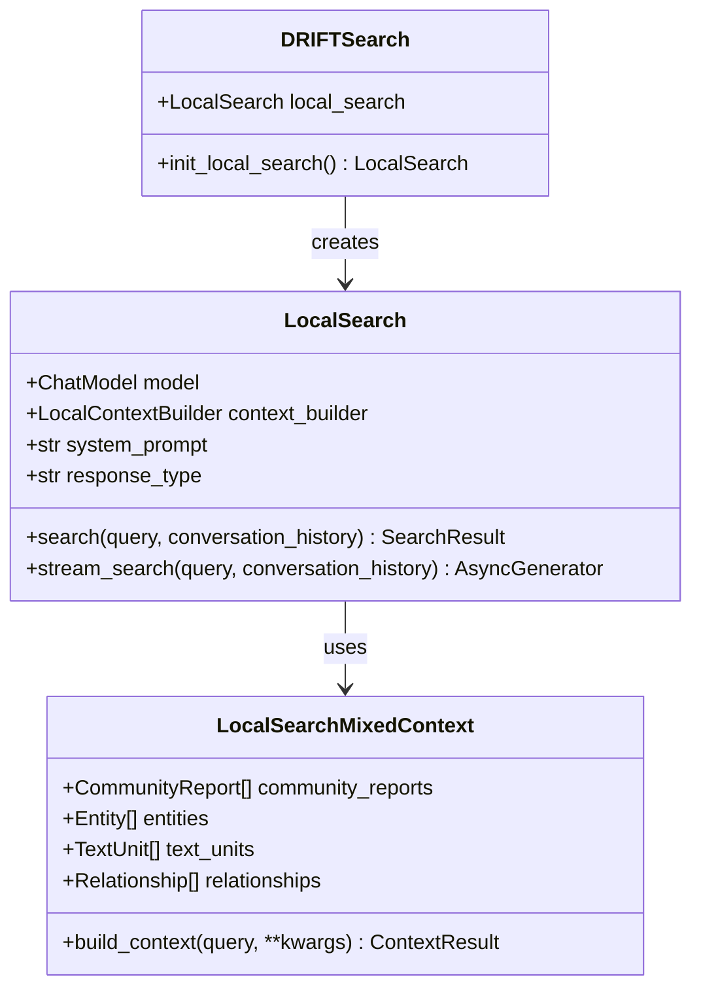

**Diagram sources**
- [search.py](file://graphrag/query/structured_search/drift_search/search.py#L68-L108)
- [local_search/search.py](file://graphrag/query/structured_search/local_search/search.py#L26-L49)

### Context Building Integration

The local search integrates seamlessly with the broader DRIFT context:

| Component | Role | Integration Point |
|-----------|------|------------------|
| Community Reports | Knowledge base | Mixed context builder |
| Entity Graph | Navigation | Entity extraction |
| Text Units | Evidence | Content retrieval |
| Relationships | Context | Relationship filtering |

### Search Parameter Propagation

The local search inherits configuration from the DRIFT context while maintaining flexibility:

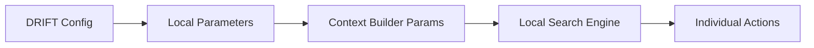

**Diagram sources**
- [search.py](file://graphrag/query/structured_search/drift_search/search.py#L68-L108)

**Section sources**
- [search.py](file://graphrag/query/structured_search/drift_search/search.py#L68-L108)
- [local_search/search.py](file://graphrag/query/structured_search/local_search/search.py#L26-L49)

## Common Issues and Solutions

### Infinite Loops

**Problem**: The recursive nature of DRIFT can lead to infinite loops if follow-up queries perpetually generate new actions.

**Solution**: The system implements several safeguards:

1. **Depth Limiting**: `n_depth` parameter controls maximum recursion
2. **Action Completion**: `is_complete` property prevents reprocessing
3. **Cycle Detection**: Graph structure inherently prevents cycles

### Query Drift

**Problem**: Generated follow-up queries may diverge from the original query scope.

**Solution**: The system maintains query coherence through:

1. **Global Query Context**: Each action receives the original query
2. **Score-Based Ranking**: Actions are ranked by relevance to original query
3. **Context Preservation**: Local search maintains original context

### Performance Issues

**Problem**: Large-scale DRIFT searches can become computationally expensive.

**Solutions**:

| Issue | Solution | Implementation |
|-------|----------|----------------|
| Memory Usage | State pruning | Remove completed actions periodically |
| LLM Costs | Batch processing | Use `primer_folds` for parallel decomposition |
| Latency | Concurrency limits | Configure `drift_k_followups` appropriately |

### Token Limit Exceeded

**Problem**: Long queries or responses exceed LLM token limits.

**Solutions**:

1. **Context Truncation**: Automatic truncation of context windows
2. **Response Summarization**: Use `reduce_max_tokens` for response compression
3. **Streaming**: Implement streaming for large responses

**Section sources**
- [search.py](file://graphrag/query/structured_search/drift_search/search.py#L230-L251)
- [state.py](file://graphrag/query/structured_search/drift_search/state.py#L55-L77)

## Performance Optimization

### Concurrency Control

Effective concurrency management is crucial for DRIFT performance:

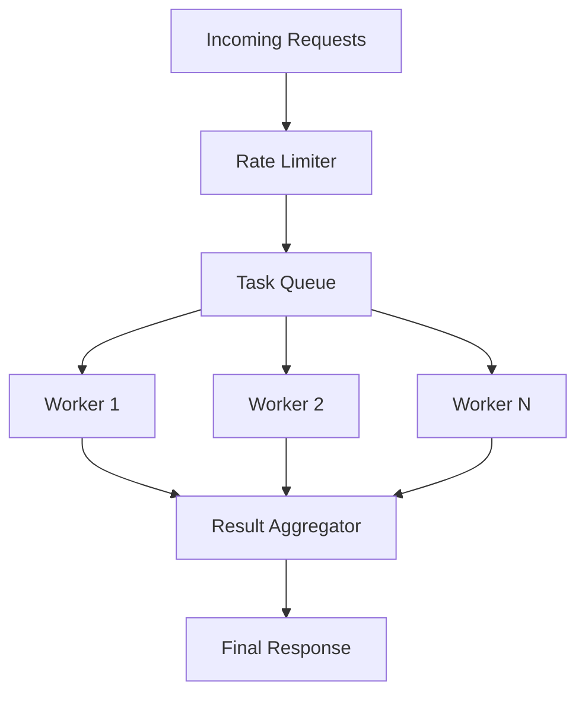

### Memory Management

The system implements several memory optimization strategies:

1. **Lazy Loading**: Community reports loaded on demand
2. **State Pruning**: Remove completed actions from active state
3. **Batch Processing**: Process reports in batches to control memory

### Caching Strategies

| Cache Type | Implementation | Benefit |
|------------|----------------|---------|
| Embedding Cache | Vector store caching | Avoid redundant embeddings |
| Context Cache | Local search result caching | Reuse expensive context builds |
| State Cache | Graph serialization | Persist search state |

### Monitoring and Metrics

The system tracks comprehensive metrics for performance monitoring:

| Metric Category | Tracked Metrics | Purpose |
|-----------------|-----------------|---------|
| LLM Usage | Calls, tokens, costs | Cost optimization |
| Execution Time | Per-operation timing | Performance tuning |
| Resource Utilization | Memory, CPU usage | Capacity planning |
| Quality Metrics | Action scores, completion rates | Accuracy assessment |

**Section sources**
- [search.py](file://graphrag/query/structured_search/drift_search/search.py#L255-L301)
- [state.py](file://graphrag/query structured_search/drift_search/state.py#L139-L151)

## Usage Examples

### Basic DRIFT Search

```python
# Initialize DRIFT search engine
drift_search = DRIFTSearch(
    model=chat_model,
    context_builder=context_builder,
    tokenizer=tokenizer,
    query_state=query_state,
    callbacks=callbacks
)

# Execute search
result = await drift_search.search(
    query="What are the key findings about climate change?",
    reduce=True
)
```

### Streaming DRIFT Search

```python
# Stream search results
async for chunk in drift_search.stream_search(
    query="Explain quantum computing fundamentals",
    conversation_history=None
):
    print(chunk, end="", flush=True)
```

### Custom Configuration

```python
# Configure DRIFT parameters
config = DRIFTSearchConfig(
    n_depth=5,                    # Increased depth for complex queries
    drift_k_followups=100,        # More parallelism
    primer_folds=4,               # Parallel decomposition
    local_search_max_data_tokens=15000  # Larger context window
)

# Apply configuration
context_builder = DRIFTSearchContextBuilder(
    model=chat_model,
    text_embedder=text_embedder,
    entities=entities,
    entity_text_embeddings=embeddings,
    reports=community_reports,
    config=config
)
```

### Error Handling Example

```python
try:
    result = await drift_search.search(query="complex scientific question")
    print(f"Response: {result.response}")
    print(f"Completion time: {result.completion_time}s")
    print(f"Total tokens: {result.prompt_tokens + result.output_tokens}")
except ValueError as e:
    print(f"Query error: {e}")
except Exception as e:
    print(f"Unexpected error: {e}")
```

### State Persistence Example

```python
# Serialize current state
state_data = query_state.serialize(include_context=True)

# Later, restore state
query_state.deserialize(state_data)
```

**Section sources**
- [search.py](file://graphrag/query/structured_search/drift_search/search.py#L179-L301)
- [base.py](file://graphrag/query/structured_search/base.py#L55-L93)