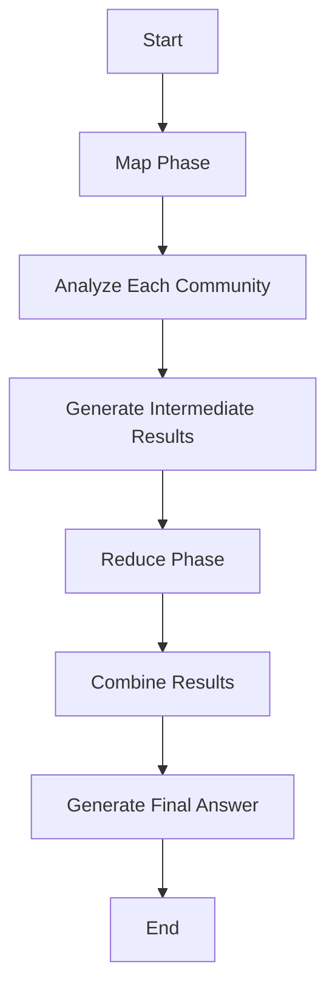
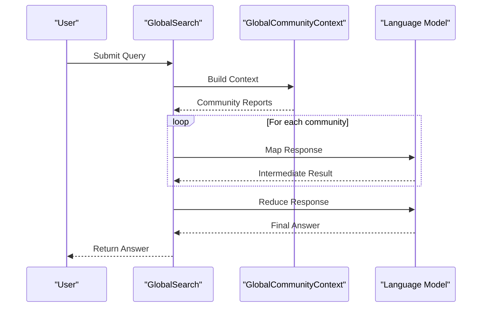

# Global Search

<cite>
**Referenced Files in This Document**   
- [global_search_config.py](file://graphrag/config/models/global_search_config.py)
- [search.py](file://graphrag/query/structured_search/global_search/search.py)
- [community_context.py](file://graphrag/query/structured_search/global_search/community_context.py)
- [global_search_map_system_prompt.py](file://graphrag/prompts/query/global_search_map_system_prompt.py)
- [global_search_reduce_system_prompt.py](file://graphrag/prompts/query/global_search_reduce_system_prompt.py)
- [global_search_knowledge_system_prompt.py](file://graphrag/prompts/query/global_search_knowledge_system_prompt.py)
- [dynamic_community_selection.py](file://graphrag/query/context_builder/dynamic_community_selection.py)
- [community_context.py](file://graphrag/query/context_builder/community_context.py)
- [query.py](file://graphrag/api/query.py)
- [factory.py](file://graphrag/query/factory.py)
</cite>

## Table of Contents
1. [Introduction](#introduction)
2. [Map-Reduce Pattern in Global Search](#map-reduce-pattern-in-global-search)
3. [Community Context Builder](#community-context-builder)
4. [Two-Phase Execution Process](#two-phase-execution-process)
5. [Configuration Options](#configuration-options)
6. [Global Search Streaming API](#global-search-streaming-api)
7. [Handling Large Knowledge Bases](#handling-large-knowledge-bases)
8. [Relationship with Community Detection](#relationship-with-community-detection)
9. [Conclusion](#conclusion)

## Introduction
Global Search in GraphRAG is a sophisticated feature designed to analyze entire knowledge graphs by processing community reports at scale. It leverages a Map-Reduce pattern to efficiently handle large datasets, breaking down the analysis into manageable chunks and then synthesizing the results into comprehensive answers. This approach enables the system to provide detailed insights while maintaining performance and scalability.

**Section sources**
- [search.py](file://graphrag/query/structured_search/global_search/search.py#L1-L50)

## Map-Reduce Pattern in Global Search
The Global Search feature employs a Map-Reduce pattern to analyze knowledge graphs. This pattern consists of two main phases: the map phase and the reduce phase. In the map phase, each community is analyzed independently to generate intermediate results. These results are then combined in the reduce phase to produce a final, comprehensive answer.

The map phase involves parallel LLM calls on communities' short summaries to generate answers for each batch. This allows the system to process multiple communities simultaneously, significantly improving efficiency. The reduce phase combines these intermediate answers to generate the final response to the user's query.

**Diagram sources**
- [search.py](file://graphrag/query/structured_search/global_search/search.py#L144-L148)

## Community Context Builder
The community context builder plays a crucial role in aggregating insights from multiple communities. It prepares batches of community report data tables as context data for the global search. This involves building context from community reports, entities, and conversation history.

The context builder uses dynamic community selection to identify relevant communities based on the query. It rates community reports and selects those with a rating equal to or above a specified threshold. This ensures that only the most relevant communities are included in the analysis, improving the quality of the final answer.

**Section sources**
- [community_context.py](file://graphrag/query/structured_search/global_search/community_context.py#L26-L54)

## Two-Phase Execution Process
The two-phase execution process in Global Search consists of the map phase and the reduce phase. In the map phase, the system generates answers for each batch of community short summaries. This is done by calling the `_map_response_single_batch` method for each community report.

In the reduce phase, the system combines the intermediate responses from the map phase into a final answer. This involves sorting the key points by their importance score and then synthesizing them into a comprehensive response. The reduce phase also handles cases where no relevant information is found, returning a default "I do not know" answer.

**Diagram sources**
- [search.py](file://graphrag/query/structured_search/global_search/search.py#L144-L148)

## Configuration Options
The Global Search feature is highly configurable, with several options available in the `global_search_config.py` file. These options include:

- **map_prompt**: The prompt used in the map phase to generate intermediate results.
- **reduce_prompt**: The prompt used in the reduce phase to synthesize the final answer.
- **knowledge_prompt**: The general prompt used for incorporating real-world knowledge.
- **dynamic_search_threshold**: The rating threshold for including a community report.
- **dynamic_search_max_level**: The maximum level of community hierarchy to consider.

These configuration options allow users to fine-tune the behavior of the Global Search feature to suit their specific needs.

**Section sources**
- [global_search_config.py](file://graphrag/config/models/global_search_config.py#L11-L67)

## Global Search Streaming API
The Global Search Streaming API orchestrates the distributed analysis of the knowledge graph. It uses the `global_search_streaming` function to execute the search and return the results in a streaming fashion. This allows users to receive partial results as they become available, improving the responsiveness of the system.

The API handles the entire search process, from building the context to generating the final answer. It also manages callbacks for monitoring the progress of the search and handling errors.

**Section sources**
- [query.py](file://graphrag/api/query.py#L159-L192)

## Handling Large Knowledge Bases
Global Search is designed to handle large knowledge bases efficiently. It uses several strategies to optimize performance, including parallel processing, token usage optimization, and dynamic community selection.

Parallel processing allows the system to analyze multiple communities simultaneously, reducing the overall processing time. Token usage optimization ensures that the system stays within the token limits of the language model, preventing errors and improving efficiency. Dynamic community selection helps to focus the analysis on the most relevant communities, reducing the amount of data that needs to be processed.

**Section sources**
- [search.py](file://graphrag/query/structured_search/global_search/search.py#L113-L121)

## Relationship with Community Detection
The effectiveness of Global Search is closely tied to the community detection process during indexing. Community detection identifies groups of related entities and relationships, which are then used to create community reports. These reports serve as the basis for the analysis in the Global Search feature.

The quality of the community detection process directly impacts the quality of the results produced by Global Search. Accurate and meaningful communities lead to more relevant and insightful answers. Therefore, it is essential to ensure that the community detection process is well-tuned and produces high-quality results.

**Section sources**
- [community_context.py](file://graphrag/query/structured_search/global_search/community_context.py#L26-L54)

## Conclusion
The Global Search feature in GraphRAG is a powerful tool for analyzing knowledge graphs at scale. By leveraging a Map-Reduce pattern and a sophisticated community context builder, it is able to provide comprehensive and insightful answers to user queries. The feature is highly configurable and optimized for performance, making it suitable for a wide range of applications.