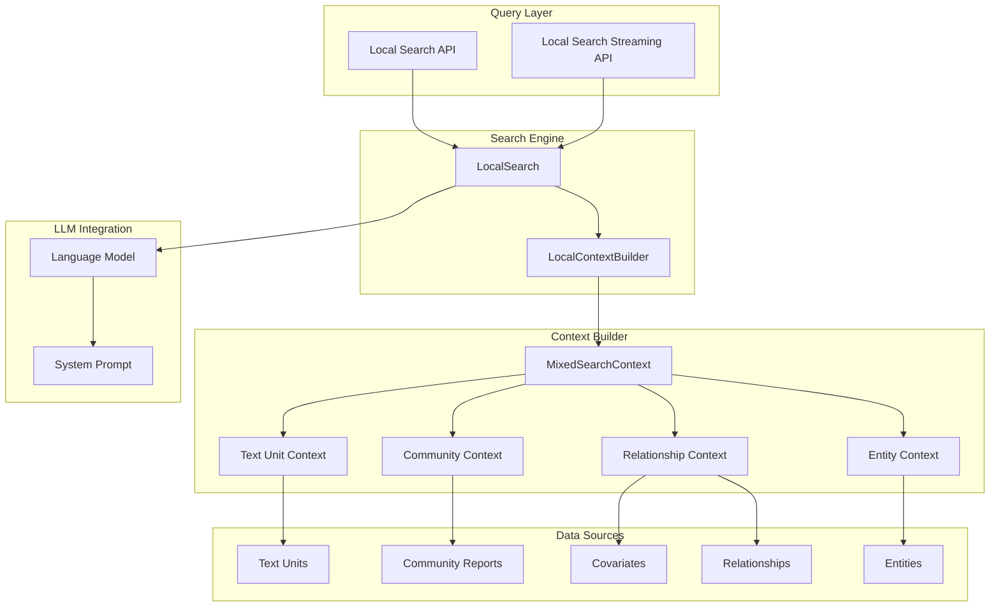
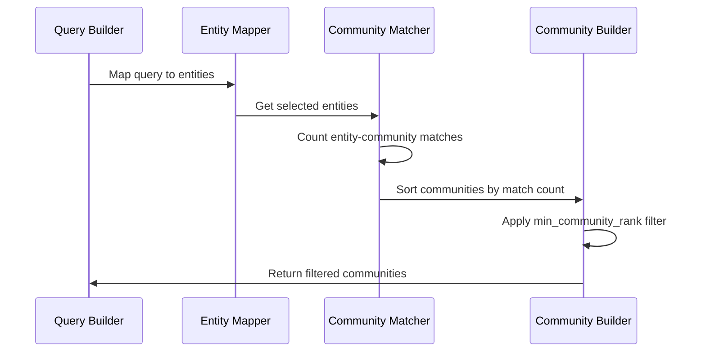
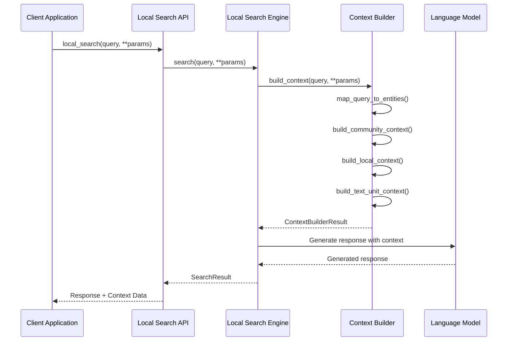
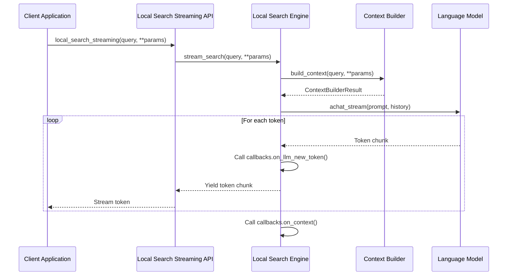
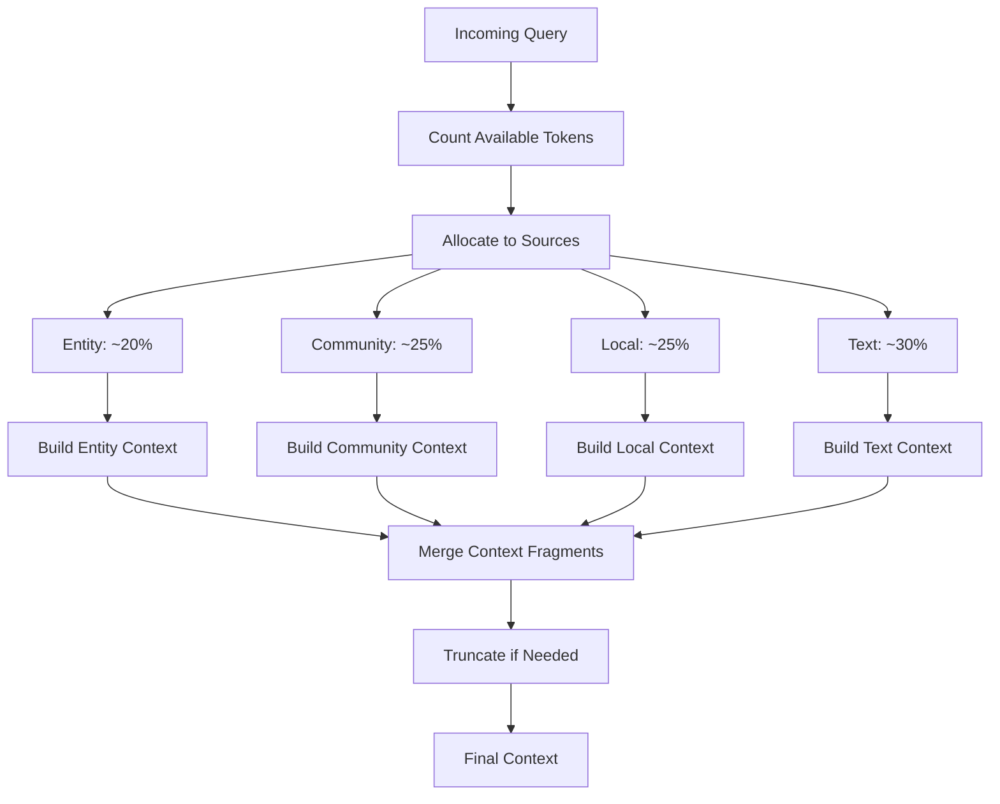

# Local Search

<cite>
**Referenced Files in This Document**
- [search.py](file://graphrag/query/structured_search/local_search/search.py)
- [mixed_context.py](file://graphrag/query/structured_search/local_search/mixed_context.py)
- [local_search_config.py](file://graphrag/config/models/local_search_config.py)
- [query.py](file://graphrag/api/query.py)
- [builders.py](file://graphrag/query/context_builder/builders.py)
- [factory.py](file://graphrag/query/factory.py)
- [local_search_system_prompt.py](file://graphrag/prompts/query/local_search_system_prompt.py)
- [community_context.py](file://graphrag/query/context_builder/community_context.py)
- [local_context.py](file://graphrag/query/context_builder/local_context.py)
- [defaults.py](file://graphrag/config/defaults.py)
</cite>

## Table of Contents
1. [Introduction](#introduction)
2. [Architecture Overview](#architecture-overview)
3. [Core Components](#core-components)
4. [MixedSearchContextBuilder Implementation](#mixedsearchcontextbuilder-implementation)
5. [Query Execution Flow](#query-execution-flow)
6. [Configuration Options](#configuration-options)
7. [API Implementation](#api-implementation)
8. [Performance Optimization](#performance-optimization)
9. [Common Issues and Solutions](#common-issues-and-solutions)
10. [Best Practices](#best-practices)

## Introduction

Local Search is a sophisticated feature in GraphRAG that retrieves information by combining entity, community, and text unit contexts to answer queries with high precision. Unlike global search, which operates at the community level, local search focuses on retrieving detailed information from specific entities and their immediate relationships, providing more granular and contextually relevant answers.

The Local Search feature employs a MixedSearchContextBuilder that intelligently combines multiple data sources including:
- **Entity information**: Descriptions, attributes, and rankings
- **Relationship data**: Connections between entities with weights and attributes
- **Community reports**: Summaries and detailed content from relevant communities
- **Text units**: Original source documents and their context
- **Covariates**: Additional metadata and temporal information

## Architecture Overview

The Local Search architecture follows a modular design with clear separation of concerns:



**Diagram sources**
- [search.py](file://graphrag/query/structured_search/local_search/search.py#L26-L164)
- [mixed_context.py](file://graphrag/query/structured_search/local_search/mixed_context.py#L50-L494)
- [builders.py](file://graphrag/query/context_builder/builders.py#L40-L50)

## Core Components

### LocalSearch Class

The [`LocalSearch`](file://graphrag/query/structured_search/local_search/search.py#L26-L164) class serves as the main orchestrator for local search operations. It inherits from `BaseSearch` and manages the complete search lifecycle from query processing to response generation.

Key responsibilities:
- **Context Building**: Coordinates the construction of rich contextual information
- **LLM Integration**: Manages communication with language models
- **Response Generation**: Handles both synchronous and streaming response generation
- **Callback Management**: Supports extensible callback mechanisms for monitoring and logging

### LocalContextBuilder Interface

The [`LocalContextBuilder`](file://graphrag/query/context_builder/builders.py#L40-L50) interface defines the contract for building context in local search scenarios. It ensures consistent behavior across different context-building strategies.

### MixedSearchContext Implementation

The [`LocalSearchMixedContext`](file://graphrag/query/structured_search/local_search/mixed_context.py#L50-L494) class is the primary implementation of the LocalContextBuilder interface. It combines multiple data sources to create comprehensive context for queries.

**Section sources**
- [search.py](file://graphrag/query/structured_search/local_search/search.py#L26-L164)
- [builders.py](file://graphrag/query/context_builder/builders.py#L40-L50)
- [mixed_context.py](file://graphrag/query/structured_search/local_search/mixed_context.py#L50-L494)

## MixedSearchContextBuilder Implementation

The MixedSearchContextBuilder is the heart of the local search system, responsible for intelligently combining multiple data sources to create rich contextual information.

### Context Construction Strategy

The builder employs a sophisticated proportional allocation strategy:

```mermaid
flowchart TD
Start([Query Input]) --> ParseQuery[Parse Query & Conversation History]
ParseQuery --> EntityMapping[Map Query to Entities]
EntityMapping --> AllocateTokens[Allocate Tokens Based on Proportions]
AllocateTokens --> CommunityTokens[Community: community_prop * max_tokens]
AllocateTokens --> LocalTokens[Local: (1 - community_prop - text_unit_prop) * max_tokens]
AllocateTokens --> TextTokens[Text: text_unit_prop * max_tokens]
CommunityTokens --> BuildCommunity[Build Community Context]
LocalTokens --> BuildLocal[Build Local Context<br/>(Entities + Relationships + Covariates)]
TextTokens --> BuildText[Build Text Unit Context]
BuildCommunity --> CombineContext[Combine All Contexts]
BuildLocal --> CombineContext
BuildText --> CombineContext
CombineContext --> FinalContext[Final Context Output]
```

**Diagram sources**
- [mixed_context.py](file://graphrag/query/structured_search/local_search/mixed_context.py#L115-L217)

### Proportional Allocation Algorithm

The context builder uses a mathematical formula to allocate tokens among different context types:

- **Community Context**: `community_tokens = max_context_tokens * community_prop`
- **Local Context**: `local_tokens = max_context_tokens * (1 - community_prop - text_unit_prop)`
- **Text Unit Context**: `text_unit_tokens = max_context_tokens * text_unit_prop`

This ensures that the total context respects the `max_context_tokens` limit while maintaining the desired balance between different information sources.

### Community Level Filtering

The system implements intelligent community filtering based on entity relationships:



**Diagram sources**
- [mixed_context.py](file://graphrag/query/structured_search/local_search/mixed_context.py#L224-L290)
- [community_context.py](file://graphrag/query/context_builder/community_context.py#L47-L225)

### Entity-Rich Context Building

The local context construction process builds comprehensive entity information progressively:

1. **Entity Context**: Basic entity information with descriptions
2. **Relationship Context**: Connections between selected entities
3. **Covariate Context**: Additional metadata and temporal information
4. **Token Limit Enforcement**: Progressive addition with token counting

**Section sources**
- [mixed_context.py](file://graphrag/query/structured_search/local_search/mixed_context.py#L50-L494)
- [community_context.py](file://graphrag/query/context_builder/community_context.py#L24-L200)
- [local_context.py](file://graphrag/query/context_builder/local_context.py#L30-L200)

## Query Execution Flow

The local search query execution follows a well-defined flow that ensures optimal context construction and response generation.

### Standard Search Flow



**Diagram sources**
- [search.py](file://graphrag/query/structured_search/local_search/search.py#L51-L118)
- [query.py](file://graphrag/api/query.py#L342-L406)

### Streaming Search Flow

The streaming variant provides real-time response generation:



**Diagram sources**
- [search.py](file://graphrag/query/structured_search/local_search/search.py#L132-L164)
- [query.py](file://graphrag/api/query.py#L410-L472)

### Context Construction Details

The context construction process involves several sophisticated steps:

1. **Entity Mapping**: Uses semantic search to find relevant entities
2. **Community Selection**: Filters communities based on entity relationships
3. **Progressive Context Building**: Adds information incrementally with token limits
4. **Candidate Context**: Provides both included and excluded context data

**Section sources**
- [search.py](file://graphrag/query/structured_search/local_search/search.py#L51-L164)
- [query.py](file://graphrag/api/query.py#L342-L472)

## Configuration Options

The Local Search feature provides extensive configuration options through the [`LocalSearchConfig`](file://graphrag/config/models/local_search_config.py#L11-L50) class and related parameters.

### Core Configuration Parameters

| Parameter | Type | Default | Description |
|-----------|------|---------|-------------|
| `max_context_tokens` | int | 8000 | Maximum tokens for combined context |
| `text_unit_prop` | float | 0.5 | Proportion allocated to text units |
| `community_prop` | float | 0.25 | Proportion allocated to community reports |
| `top_k_entities` | int | 10 | Number of mapped entities to include |
| `top_k_relationships` | int | 10 | Number of relationships to include per entity |
| `conversation_history_max_turns` | int | 5 | Maximum conversation history turns |

### Advanced Configuration Options

| Parameter | Type | Default | Description |
|-----------|------|---------|-------------|
| `include_entity_rank` | bool | True | Include entity ranking information |
| `include_relationship_weight` | bool | True | Include relationship weights |
| `include_community_rank` | bool | False | Include community ranking |
| `use_community_summary` | bool | False | Use summaries vs full content |
| `return_candidate_context` | bool | False | Return all candidates, not just context |
| `min_community_rank` | int | 0 | Minimum community rank threshold |

### System Prompt Configuration

The [`LOCAL_SEARCH_SYSTEM_PROMPT`](file://graphrag/prompts/query/local_search_system_prompt.py#L6-L70) defines the behavior and formatting requirements:

- **Role Definition**: Assistant responding to data queries
- **Response Format**: Target length and format specification
- **Citation Requirements**: Data reference formatting with record IDs
- **Knowledge Integration**: Incorporation of relevant general knowledge

**Section sources**
- [local_search_config.py](file://graphrag/config/models/local_search_config.py#L11-L50)
- [defaults.py](file://graphrag/config/defaults.py#L132-L200)
- [local_search_system_prompt.py](file://graphrag/prompts/query/local_search_system_prompt.py#L6-L70)

## API Implementation

The Local Search feature exposes two main APIs through the [`query.py`](file://graphrag/api/query.py#L342-L472) module.

### Synchronous Local Search API

The [`local_search`](file://graphrag/api/query.py#L342-L406) function provides synchronous search capabilities:

```python
async def local_search(
    config: GraphRagConfig,
    entities: pd.DataFrame,
    communities: pd.DataFrame,
    community_reports: pd.DataFrame,
    text_units: pd.DataFrame,
    relationships: pd.DataFrame,
    covariates: pd.DataFrame | None,
    community_level: int,
    response_type: str,
    query: str,
    callbacks: list[QueryCallbacks] | None = None,
    verbose: bool = False,
) -> tuple[str | dict[str, Any] | list[dict[str, Any]], str | list[pd.DataFrame] | dict[str, pd.DataFrame]]
```

**Key Features:**
- Comprehensive parameter validation
- Automatic context data collection
- Detailed response statistics
- Extensible callback support

### Streaming Local Search API

The [`local_search_streaming`](file://graphrag/api/query.py#L410-L472) function enables real-time response generation:

```python
def local_search_streaming(
    config: GraphRagConfig,
    entities: pd.DataFrame,
    communities: pd.DataFrame,
    community_reports: pd.DataFrame,
    text_units: pd.DataFrame,
    relationships: pd.DataFrame,
    covariates: pd.DataFrame | None,
    community_level: int,
    response_type: str,
    query: str,
    callbacks: list[QueryCallbacks] | None = None,
    verbose: bool = False,
) -> AsyncGenerator
```

**Streaming Benefits:**
- Real-time response delivery
- Memory-efficient processing
- Immediate user feedback
- Progressive information loading

### Multi-Index Support

Both APIs support multi-index operations through [`multi_index_local_search`](file://graphrag/api/query.py#L476-L704):

- **Index Merging**: Combines data from multiple indexes
- **ID Normalization**: Ensures unique identifiers across indexes
- **Link Preservation**: Maintains relationships between indexed data
- **Unified Results**: Returns coherent responses across indexes

**Section sources**
- [query.py](file://graphrag/api/query.py#L342-L472)
- [query.py](file://graphrag/api/query.py#L476-L704)

## Performance Optimization

### Token Management Strategies

The system implements several strategies to optimize token usage and performance:

#### Proportional Allocation
- **Dynamic Distribution**: Adjusts context proportions based on query characteristics
- **Token Budgeting**: Ensures efficient use of available token budget
- **Priority Ordering**: Builds context in order of importance

#### Progressive Context Building
- **Incremental Addition**: Adds information progressively with token counting
- **Early Termination**: Stops when token limit reached
- **Quality Preservation**: Maintains context quality within constraints

#### Caching and Reuse
- **Entity Mapping Cache**: Reuses entity-to-query mappings
- **Community Weight Cache**: Caches computed community weights
- **Context Fragment Cache**: Reuses previously built context fragments

### Memory Optimization



**Diagram sources**
- [mixed_context.py](file://graphrag/query/structured_search/local_search/mixed_context.py#L115-L217)

### Performance Monitoring

The system provides comprehensive performance metrics:

- **Token Usage Tracking**: Monitors prompt and output tokens
- **LLM Call Statistics**: Tracks number of model calls
- **Execution Timing**: Measures query processing time
- **Context Size Analysis**: Tracks context composition

**Section sources**
- [mixed_context.py](file://graphrag/query/structured_search/local_search/mixed_context.py#L115-L217)
- [search.py](file://graphrag/query/structured_search/local_search/search.py#L70-L118)

## Common Issues and Solutions

### Context Overflow Problems

**Issue**: Context exceeds token limits
**Solution**: Adjust proportion parameters or reduce `max_context_tokens`

**Diagnostic Steps**:
1. Monitor token usage in logs
2. Adjust `text_unit_prop` and `community_prop`
3. Increase `max_context_tokens` if appropriate
4. Enable `return_candidate_context` for analysis

### Performance Degradation

**Issue**: Slow response times
**Solutions**:
- Reduce `top_k_entities` and `top_k_relationships`
- Enable caching for frequently accessed data
- Optimize vector store configurations
- Use streaming for large responses

### Quality Issues

**Issue**: Low-quality or irrelevant responses
**Solutions**:
- Improve entity mapping accuracy
- Adjust community filtering thresholds
- Enhance conversation history handling
- Fine-tune system prompt parameters

### Memory Issues

**Issue**: High memory consumption
**Solutions**:
- Reduce batch sizes for context building
- Implement progressive context loading
- Use streaming APIs for large datasets
- Optimize data preprocessing

## Best Practices

### Configuration Guidelines

1. **Start Conservative**: Begin with default proportions and adjust based on results
2. **Monitor Performance**: Track token usage and response times
3. **Balance Quality vs Speed**: Adjust parameters based on application requirements
4. **Test Edge Cases**: Verify behavior with complex queries and large datasets

### Implementation Recommendations

1. **Use Streaming for Large Responses**: Enable streaming for queries likely to produce long responses
2. **Implement Proper Error Handling**: Handle context overflow and LLM failures gracefully
3. **Enable Callbacks for Monitoring**: Use callback mechanisms for production monitoring
4. **Cache Frequently Used Data**: Implement caching for entity mappings and community weights

### Query Optimization

1. **Provide Context History**: Use conversation history for better context
2. **Structure Queries Clearly**: Format queries to maximize entity mapping accuracy
3. **Limit Scope**: Use filters to reduce search scope when appropriate
4. **Monitor Quality Metrics**: Track response relevance and completeness

### Production Deployment

1. **Set Appropriate Limits**: Configure reasonable limits for all parameters
2. **Implement Rate Limiting**: Protect against abuse and resource exhaustion
3. **Monitor Resource Usage**: Track memory and CPU consumption
4. **Log Comprehensive Metrics**: Enable detailed logging for troubleshooting

The Local Search feature in GraphRAG provides a powerful foundation for precise information retrieval through its sophisticated context building and query execution capabilities. By understanding its architecture, configuration options, and optimization strategies, developers can effectively leverage this feature to build robust and performant knowledge-intensive applications.