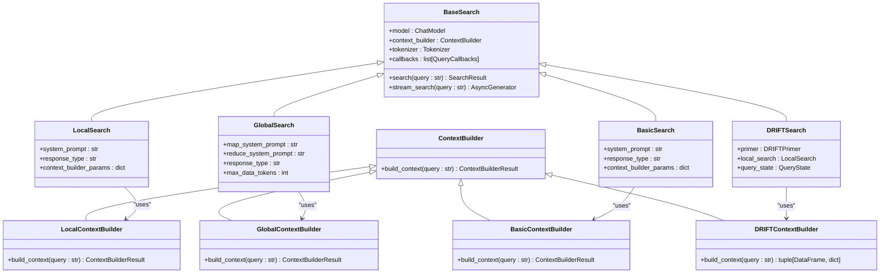

# Search Methods Overview

<cite>
**Referenced Files in This Document**   
- [factory.py](file://graphrag/query/factory.py)
- [local_search.py](file://graphrag/query/structured_search/local_search/search.py)
- [global_search.py](file://graphrag/query/structured_search/global_search/search.py)
- [basic_search.py](file://graphrag/query/structured_search/basic_search/search.py)
- [drift_search.py](file://graphrag/query/structured_search/drift_search/search.py)
- [local_search_config.py](file://graphrag/config/models/local_search_config.py)
- [global_search_config.py](file://graphrag/config/models/global_search_config.py)
- [basic_search_config.py](file://graphrag/config/models/basic_search_config.py)
- [drift_search_config.py](file://graphrag/config/models/drift_search_config.py)
- [mixed_context.py](file://graphrag/query/structured_search/local_search/mixed_context.py)
- [community_context.py](file://graphrag/query/structured_search/global_search/community_context.py)
- [basic_context.py](file://graphrag/query/structured_search/basic_search/basic_context.py)
- [drift_context.py](file://graphrag/query/structured_search/drift_search/drift_context.py)
</cite>

## Table of Contents
1. [Introduction](#introduction)
2. [Search Method Architecture](#search-method-architecture)
3. [Factory Pattern Implementation](#factory-pattern-implementation)
4. [Query Execution Flow](#query-execution-flow)
5. [Local Search Method](#local-search-method)
6. [Global Search Method](#global-search-method)
7. [Basic Search Method](#basic-search-method)
8. [DRIFT Search Method](#drift-search-method)
9. [Context Builders](#context-builders)
10. [Performance Characteristics](#performance-characteristics)
11. [Caching and Vector Store Integration](#caching-and-vector-store-integration)
12. [Choosing the Right Search Method](#choosing-the-right-search-method)

## Introduction

GraphRAG provides a sophisticated query system that supports multiple search methodologies through a unified interface. The system implements four distinct search approaches: local, global, basic, and DRIFT (Dynamic Recursive Iterative Following of Topics). Each method is designed to address different information retrieval scenarios, from focused entity-based queries to comprehensive knowledge synthesis across entire document collections.

The architecture is built around a factory pattern that creates specialized search engines based on configuration parameters, allowing users to select the most appropriate search strategy for their use case. All search methods follow a consistent execution flow from input parsing to context building to LLM response generation, but differ significantly in how they retrieve and process relevant entities, communities, and text units to construct context for the language model.

This documentation provides a comprehensive overview of the search methods in GraphRAG, explaining the architectural patterns, execution flows, and performance characteristics of each approach to help users understand how queries are processed and how to choose the right search method for their specific needs.

## Search Method Architecture

GraphRAG's search architecture is designed around a modular, extensible framework that supports multiple search methodologies through a common interface. At the core of this architecture is the `BaseSearch` class, which defines the fundamental contract for all search implementations. Each search method inherits from this base class and implements its specific logic while maintaining compatibility with the unified query interface.

The architecture follows a clear separation of concerns between search orchestration, context building, and LLM interaction. The search engines are responsible for coordinating the overall query process, while specialized context builders handle the retrieval and organization of relevant information from the knowledge graph. This separation allows for flexible composition of different search strategies with various context construction approaches.

All search methods share a common execution pattern that begins with query parsing and context building, followed by LLM interaction to generate responses. However, they differ significantly in their approach to context construction, with some methods focusing on local neighborhood exploration (local search), others on global knowledge synthesis (global search), and specialized approaches like DRIFT that use iterative refinement.

**Diagram sources**
- [graphrag/query/structured_search/base.py](file://graphrag/query/structured_search/base.py)
- [graphrag/query/structured_search/local_search/search.py](file://graphrag/query/structured_search/local_search/search.py)
- [graphrag/query/structured_search/global_search/search.py](file://graphrag/query/structured_search/global_search/search.py)
- [graphrag/query/structured_search/basic_search/search.py](file://graphrag/query/structured_search/basic_search/search.py)
- [graphrag/query/structured_search/drift_search/search.py](file://graphrag/query/structured_search/drift_search/search.py)
- [graphrag/query/context_builder/builders.py](file://graphrag/query/context_builder/builders.py)

## Factory Pattern Implementation

GraphRAG employs a factory pattern to instantiate different search strategies based on configuration, providing a clean abstraction layer between the query interface and the underlying search implementations. The factory functions—`get_local_search_engine`, `get_global_search_engine`, `get_basic_search_engine`, and `get_drift_search_engine`—are responsible for creating and configuring the appropriate search engine instances with all necessary dependencies.

Each factory function follows a consistent pattern: it takes configuration parameters and data inputs, retrieves the appropriate language model settings from the configuration, creates the required LLM instances, and then instantiates the search engine with these components. This approach centralizes the creation logic and ensures consistent configuration across all search methods.

The factory pattern enables several key benefits:
- **Configuration-driven instantiation**: Search engines are created based on configuration parameters, allowing users to modify behavior without changing code
- **Dependency injection**: All required components (LLMs, context builders, tokenizers) are injected through the factory, promoting loose coupling
- **Consistent initialization**: Each search engine is initialized with the same set of core components, ensuring predictable behavior
- **Extensibility**: New search methods can be added by implementing the base interface and adding a corresponding factory function

**Diagram sources**
- [graphrag/query/factory.py](file://graphrag/query/factory.py)
- [graphrag/config/models/graph_rag_config.py](file://graphrag/config/models/graph_rag_config.py)
- [graphrag/language_model/manager.py](file://graphrag/language_model/manager.py)

## Query Execution Flow

The query execution flow in GraphRAG follows a consistent pattern across all search methods, consisting of several well-defined stages from input processing to final response generation. While the specific implementation details vary between search methods, the overall flow maintains a common structure that ensures predictable behavior and facilitates debugging and optimization.

The execution flow begins with input parsing, where the query string and any additional parameters are processed and validated. This is followed by context building, which is the most variable stage across different search methods and involves retrieving relevant entities, communities, and text units from the knowledge graph. The constructed context is then used to generate prompts for the language model, which produces the final response.

Each search method implements this flow with different strategies for context retrieval and processing. Local search focuses on immediate neighborhood exploration, global search performs parallel processing of community reports, basic search relies on vector similarity matching, and DRIFT search uses an iterative refinement process. Despite these differences, all methods return a standardized `SearchResult` object containing the response, context data, and performance metrics.

**Diagram sources**
- [graphrag/query/structured_search/base.py](file://graphrag/query/structured_search/base.py)
- [graphrag/query/structured_search/local_search/search.py](file://graphrag/query/structured_search/local_search/search.py)
- [graphrag/query/structured_search/global_search/search.py](file://graphrag/query/structured_search/global_search/search.py)
- [graphrag/query/structured_search/basic_search/search.py](file://graphrag/query/structured_search/basic_search/search.py)
- [graphrag/query/structured_search/drift_search/search.py](file://graphrag/query/structured_search/drift_search/search.py)

## Local Search Method

The local search method in GraphRAG is designed for queries that require detailed information about specific entities and their immediate relationships. This approach focuses on building a rich context by retrieving entities, relationships, community reports, and text units that are directly connected to the query, creating a comprehensive view of the local neighborhood within the knowledge graph.

Local search uses a mixed context builder that combines information from multiple sources in configurable proportions. The context builder retrieves entities relevant to the query through vector similarity search, then expands to include their relationships, community memberships, and associated text units. The relative importance of each information type can be controlled through configuration parameters that specify the proportion of context dedicated to text units, communities, and entity-relationship data.

This search method is particularly effective for queries that ask about specific people, organizations, or concepts and their direct connections. It excels at answering questions like "What are the key relationships of company X?" or "What topics are associated with research paper Y?" by providing detailed information about the immediate context of the queried entity.

**Section sources**
- [graphrag/query/structured_search/local_search/search.py](file://graphrag/query/structured_search/local_search/search.py)
- [graphrag/query/structured_search/local_search/mixed_context.py](file://graphrag/query/structured_search/local_search/mixed_context.py)
- [graphrag/config/models/local_search_config.py](file://graphrag/config/models/local_search_config.py)

## Global Search Method

The global search method in GraphRAG is designed for comprehensive queries that require synthesizing information across the entire knowledge graph. This approach uses a map-reduce pattern to process community reports in parallel, then combines the intermediate results into a cohesive response. It is particularly effective for broad, exploratory queries that seek to understand overarching themes, trends, or relationships across the entire dataset.

Global search operates in two distinct phases: the map phase and the reduce phase. In the map phase, the query is applied to each community report independently, generating intermediate responses that capture the relevance of each community to the query. These parallel operations allow the system to efficiently process large knowledge graphs by leveraging the hierarchical community structure.

In the reduce phase, the intermediate responses are combined and distilled into a single comprehensive answer. The system sorts the intermediate responses by relevance score, filters out low-scoring results, and constructs a final prompt that includes the most relevant information from across the knowledge graph. This approach enables the LLM to generate responses that synthesize information from multiple communities, providing a holistic view of the topic.

**Section sources**
- [graphrag/query/structured_search/global_search/search.py](file://graphrag/query/structured_search/global_search/search.py)
- [graphrag/query/structured_search/global_search/community_context.py](file://graphrag/query/structured_search/global_search/community_context.py)
- [graphrag/config/models/global_search_config.py](file://graphrag/config/models/global_search_config.py)

## Basic Search Method

The basic search method in GraphRAG implements a traditional RAG (Retrieval-Augmented Generation) approach, focusing on vector similarity matching against raw text chunks. This method is designed for straightforward information retrieval tasks where the goal is to find text passages most similar to the query, without leveraging the graph structure or semantic relationships between entities.

Basic search uses a simple context builder that performs similarity search on text unit embeddings to identify the most relevant passages. The retrieved text units are then formatted into a context table and used to construct a prompt for the language model. This approach is computationally efficient and provides fast responses for queries that can be answered by extracting information from specific text segments.

The basic search method is particularly effective for fact-based queries that ask for specific information contained in the source documents, such as "What was the revenue of company X in 2023?" or "What are the key findings of research paper Y?". It serves as a baseline for comparison with the more sophisticated search methods and is useful when the graph structure is not relevant to the query.

**Section sources**
- [graphrag/query/structured_search/basic_search/search.py](file://graphrag/query/structured_search/basic_search/search.py)
- [graphrag/query/structured_search/basic_search/basic_context.py](file://graphrag/query/structured_search/basic_search/basic_context.py)
- [graphrag/config/models/basic_search_config.py](file://graphrag/config/models/basic_search_config.py)

## DRIFT Search Method

The DRIFT (Dynamic Recursive Iterative Following of Topics) search method in GraphRAG is an advanced, iterative approach that combines elements of local and global search with dynamic query refinement. This method is designed for complex, exploratory queries that require deep investigation and the discovery of non-obvious connections within the knowledge graph.

DRIFT search operates through a multi-step process that begins with a "priming" phase where an initial query is used to generate intermediate answers and follow-up questions. These follow-up questions are then processed iteratively, with each step potentially expanding the search to new areas of the knowledge graph. The process continues for a configurable number of depth levels, allowing the system to follow chains of reasoning and uncover indirect relationships.

The DRIFT approach uses a stateful query process that maintains context across iterations, enabling it to build a comprehensive understanding of complex topics. Each iteration involves a local search operation on the current query, with results being aggregated and refined in subsequent steps. The final response is generated by reducing the accumulated intermediate results into a cohesive answer, providing a synthesized view of the explored topic space.

**Section sources**
- [graphrag/query/structured_search/drift_search/search.py](file://graphrag/query/structured_search/drift_search/search.py)
- [graphrag/query/structured_search/drift_search/drift_context.py](file://graphrag/query/structured_search/drift_search/drift_context.py)
- [graphrag/query/structured_search/drift_search/primer.py](file://graphrag/query/structured_search/drift_search/primer.py)
- [graphrag/config/models/drift_search_config.py](file://graphrag/config/models/drift_search_config.py)

## Context Builders

Context builders in GraphRAG are responsible for retrieving and organizing relevant information from the knowledge graph to construct the context used in LLM prompts. Each search method uses a specialized context builder that implements a different strategy for selecting and formatting information based on the search approach.

The context builders follow a common interface defined by the `ContextBuilder` abstract base class, ensuring consistency in how they interact with search engines. They are responsible for querying the knowledge graph, filtering and prioritizing information based on relevance, and formatting the results into a structured context that can be incorporated into LLM prompts.

Different context builders employ various techniques for information retrieval and prioritization:
- **LocalSearchMixedContext**: Combines entity, relationship, community, and text unit information in configurable proportions, prioritizing entities that are most similar to the query
- **GlobalCommunityContext**: Processes community reports in batches, optionally using dynamic community selection to focus on the most relevant communities
- **BasicSearchContext**: Performs vector similarity search on text unit embeddings to identify the most relevant passages
- **DRIFTSearchContextBuilder**: Orchestrates the iterative context building process, managing the state across multiple search steps

The context builders also handle important functionality such as token counting to ensure context fits within LLM limits, conversation history integration, and result formatting for optimal LLM performance.

**Section sources**
- [graphrag/query/context_builder/builders.py](file://graphrag/query/context_builder/builders.py)
- [graphrag/query/structured_search/local_search/mixed_context.py](file://graphrag/query/structured_search/local_search/mixed_context.py)
- [graphrag/query/structured_search/global_search/community_context.py](file://graphrag/query/structured_search/global_search/community_context.py)
- [graphrag/query/structured_search/basic_search/basic_context.py](file://graphrag/query/structured_search/basic_search/basic_context.py)
- [graphrag/query/structured_search/drift_search/drift_context.py](file://graphrag/query/structured_search/drift_search/drift_context.py)

## Performance Characteristics

The different search methods in GraphRAG exhibit distinct performance characteristics in terms of latency, computational complexity, and resource utilization. Understanding these characteristics is essential for selecting the appropriate search method for a given use case and for optimizing system performance.

**Local Search**: This method typically has moderate latency and computational requirements. The performance scales with the number of entities retrieved and their connected relationships. It is generally faster than global search but slower than basic search due to the complexity of retrieving and formatting multiple types of graph data.

**Global Search**: This method has the highest computational complexity due to its map-reduce pattern, which processes community reports in parallel. The latency is primarily determined by the number of community reports and the LLM response times for each map operation. However, the parallel nature of the processing can leverage multiple LLM requests simultaneously, potentially improving throughput for batch operations.

**Basic Search**: This method has the lowest latency and computational requirements, as it involves a simple vector similarity search followed by a single LLM call. The performance is primarily determined by the speed of the vector similarity search and the LLM response time, making it the fastest option for straightforward queries.

**DRIFT Search**: This method has variable performance characteristics depending on the configuration parameters, particularly the number of depth levels (n_depth) and follow-up queries (drift_k_followups). The iterative nature means that execution time increases linearly with the number of iterations, and each iteration involves multiple LLM calls. This makes DRIFT search the most computationally intensive method but also the most thorough for complex queries.

All search methods include built-in token counting and context management to prevent exceeding LLM token limits, which helps ensure predictable performance and prevents errors during execution.

## Caching and Vector Store Integration

GraphRAG integrates with vector stores for hybrid retrieval and implements caching mechanisms to improve performance and reduce redundant LLM calls. The system leverages vector similarity search as a fundamental component of its context building process, particularly for entity and text unit retrieval.

The integration with vector stores is implemented through the `BaseVectorStore` interface, which provides a consistent API for different vector database backends. This abstraction allows GraphRAG to work with various vector store implementations such as Azure AI Search, CosmosDB, and LanceDB, enabling flexibility in deployment scenarios and performance optimization.

Caching is implemented at multiple levels within the system:
- **LLM response caching**: Stores the results of LLM calls to avoid redundant processing of identical queries
- **Vector search caching**: Caches the results of vector similarity searches to speed up repeated queries
- **Context building caching**: Stores intermediate context building results to accelerate subsequent queries on similar topics

The caching system is configurable through the `CacheConfig` settings, allowing users to choose between different cache implementations (in-memory, file-based, or no caching) based on their performance requirements and resource constraints. This flexibility enables optimization for different deployment scenarios, from development environments to production systems with high query volumes.

The hybrid retrieval approach combines vector similarity search with graph traversal, allowing the system to leverage the strengths of both methods. Vector search quickly identifies relevant entities and text units, while graph traversal explores relationships and community structures to build a richer context for the LLM.

## Choosing the Right Search Method

Selecting the appropriate search method in GraphRAG depends on the nature of the query, performance requirements, and the desired depth of analysis. Each method offers different trade-offs between comprehensiveness, accuracy, and computational efficiency, making them suitable for different use cases.

**Use Local Search when**:
- The query focuses on specific entities and their immediate relationships
- You need detailed information about entity neighborhoods
- The question involves understanding connections between a small set of concepts
- You want to leverage both vector similarity and graph structure
- Example queries: "What are the key relationships of company X?", "How is concept Y connected to concept Z?"

**Use Global Search when**:
- The query requires synthesizing information across the entire knowledge graph
- You are exploring broad themes or trends in the dataset
- The question benefits from a comprehensive, holistic view
- You need to identify overarching patterns across multiple communities
- Example queries: "What are the major themes in the dataset?", "How do different research areas relate to each other?"

**Use Basic Search when**:
- The query seeks specific facts or information contained in text passages
- You need a fast response for straightforward information retrieval
- The graph structure is not relevant to the query
- You want a baseline RAG approach without graph complexity
- Example queries: "What was the revenue of company X in 2023?", "What are the key findings of research paper Y?"

**Use DRIFT Search when**:
- The query is complex and exploratory, requiring deep investigation
- You need to discover non-obvious connections and indirect relationships
- The question benefits from iterative refinement and follow-up queries
- You are conducting research or analysis that requires comprehensive exploration
- Example queries: "Explore the impact of AI on healthcare", "Investigate the connections between climate change and economic policy"

The choice of search method should also consider performance requirements, with basic search being the fastest and DRIFT search being the most computationally intensive. For applications requiring low latency, basic or local search may be preferred, while research and analysis tasks may benefit from the comprehensive exploration capabilities of global or DRIFT search.