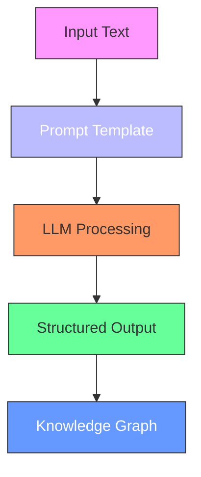

# Quickstart Guide

<cite>
**Referenced Files in This Document**   
- [README.md](file://README.md)
- [pyproject.toml](file://pyproject.toml)
- [main.py](file://graphrag/cli/main.py)
- [initialize.py](file://graphrag/cli/initialize.py)
- [index.py](file://graphrag/cli/index.py)
- [query.py](file://graphrag/cli/query.py)
- [init_content.py](file://graphrag/config/init_content.py)
- [defaults.py](file://graphrag/config/defaults.py)
- [extract_graph.py](file://graphrag/prompts/index/extract_graph.py)
- [dulce.txt](file://tests/fixtures/text/input/dulce.txt)
- [settings.yml](file://tests/fixtures/text/settings.yml)
</cite>

## Table of Contents
1. [Introduction](#introduction)
2. [Project Initialization](#project-initialization)
3. [Input Data Preparation](#input-data-preparation)
4. [Configuration Setup](#configuration-setup)
5. [Running the Indexing Pipeline](#running-the-indexing-pipeline)
6. [Executing Queries](#executing-queries)
7. [Locating Generated Artifacts](#locating-generated-artifacts)
8. [Prompt Tuning for Optimal Results](#prompt-tuning-for-optimal-results)
9. [Common Pitfalls and Considerations](#common-pitfalls-and-considerations)
10. [Conclusion](#conclusion)

## Introduction

This Quickstart Guide provides a comprehensive walkthrough for running a complete GraphRAG pipeline with minimal configuration. The guide demonstrates the end-to-end process using the "Operation Dulce" dataset, a narrative text file containing fictional mission details with multiple characters and complex relationships. By following this guide, developers can go from zero to their first query in under 15 minutes.

GraphRAG is a graph-based retrieval-augmented generation (RAG) system designed to extract meaningful, structured data from unstructured text using the power of large language models (LLMs). The system creates a knowledge graph from input documents, enabling sophisticated querying capabilities that go beyond simple keyword search.

The guide covers the complete workflow: initializing a project, preparing sample input data, running the indexing pipeline with `graphrag index`, and executing sample queries with `graphrag query`. It includes expected output at each stage and instructions for locating generated artifacts such as knowledge graphs, community reports, and embeddings.

**Section sources**
- [README.md](file://README.md#L1-L77)
- [pyproject.toml](file://pyproject.toml#L1-L266)

## Project Initialization

To begin using GraphRAG, initialize a new project with the `graphrag init` command. This command creates the necessary configuration files and directory structure for your project.

```bash
graphrag init --root ./my-graphrag-project
```

This command creates a new directory structure with the following components:
- `settings.yaml`: The main configuration file with default settings
- `.env`: Environment file for storing API keys and sensitive information
- `prompts/`: Directory containing prompt templates for various operations

The initialization process uses default values defined in the GraphRAG configuration system. These defaults include settings for LLM providers, input/output directories, and processing parameters. You can override these defaults by modifying the generated configuration files.

For existing projects or when you need to regenerate configuration files, use the `--force` flag:

```bash
graphrag init --root ./my-graphrag-project --force
```

This will overwrite existing configuration files while preserving your data and artifacts.

**Section sources**
- [main.py](file://graphrag/cli/main.py#L94-L117)
- [initialize.py](file://graphrag/cli/initialize.py#L37-L96)
- [init_content.py](file://graphrag/config/init_content.py#L13-L165)

## Input Data Preparation

GraphRAG supports multiple input data formats including text files, CSV, and JSON. For this quickstart, we'll use the "Operation Dulce" text file from the test fixtures as our sample dataset.

Create an input directory and place your data file:

```bash
mkdir -p ./my-graphrag-project/input
cp ./tests/fixtures/text/input/dulce.txt ./my-graphrag-project/input/
```

The "Operation Dulce" dataset contains a narrative about a military squad's mission with multiple characters (Agent Alex Mercer, Taylor Cruz, Jordan Hayes, Sam Rivera) and complex interpersonal dynamics. This type of narrative text is ideal for demonstrating GraphRAG's ability to extract entities and relationships from unstructured content.

For CSV input, ensure your file has a header row and organize data with text content in a dedicated column. For JSON input, structure your data as an array of objects with text fields. The system will automatically detect the file type based on the extension.

You can also process multiple files by placing them in the input directory. GraphRAG will process all files matching the configured file pattern.

**Section sources**
- [dulce.txt](file://tests/fixtures/text/input/dulce.txt#L1-L185)
- [defaults.py](file://graphrag/config/defaults.py#L291-L303)
- [settings.yml](file://tests/fixtures/text/settings.yml#L1-L48)

## Configuration Setup

After initialization, configure your environment by editing the generated files. First, update the `.env` file with your LLM provider credentials:

```bash
# .env file
GRAPHRAG_API_KEY=your-api-key-here
```

Replace `your-api-key-here` with your actual API key from your LLM provider (e.g., Azure OpenAI, OpenAI).

Next, review and modify the `settings.yaml` file as needed. The default configuration includes settings for:

- **LLM settings**: Configuration for chat and embedding models
- **Input settings**: Input directory and file type
- **Output settings**: Output, cache, and reporting directories
- **Workflow settings**: Parameters for graph extraction, clustering, and summarization

A minimal configuration override can be applied by modifying specific values. For example, to change the input file type to CSV:

```yaml
input:
  file_type: csv
```

Or to adjust the chunk size for text processing:

```yaml
chunks:
  size: 800
  overlap: 50
```

The configuration system uses sensible defaults that work for most scenarios, allowing you to start with minimal changes.

**Section sources**
- [settings.yml](file://tests/fixtures/text/settings.yml#L1-L48)
- [init_content.py](file://graphrag/config/init_content.py#L13-L165)
- [defaults.py](file://graphrag/config/defaults.py#L478-L481)

## Running the Indexing Pipeline

With your project initialized and data prepared, run the indexing pipeline to create the knowledge graph:

```bash
cd ./my-graphrag-project
graphrag index --root . --verbose
```

This command executes the complete indexing pipeline, which consists of the following stages:

1. **Input Loading**: Reads the input files from the specified directory
2. **Text Chunking**: Splits the text into manageable chunks based on the configured size and overlap
3. **Graph Extraction**: Uses LLMs to identify entities and relationships from the text chunks
4. **Graph Finalization**: Combines extracted entities and relationships into a cohesive knowledge graph
5. **Community Detection**: Applies clustering algorithms to identify communities within the graph
6. **Community Summarization**: Generates summaries for each detected community
7. **Embedding Generation**: Creates vector embeddings for entities, communities, and text units

The `--verbose` flag provides detailed logging output, showing the progress of each stage. The pipeline will display status messages indicating the completion of each step.

Expected output includes:
- Progress indicators for each workflow stage
- Statistics on extracted entities and relationships
- Community detection results
- Final indexing summary with performance metrics

The indexing process may take several minutes depending on the size of your input data and the rate limits of your LLM provider.

**Section sources**
- [main.py](file://graphrag/cli/main.py#L119-L204)
- [index.py](file://graphrag/cli/index.py#L42-L162)
- [defaults.py](file://graphrag/config/defaults.py#L202-L213)

## Executing Queries

Once indexing is complete, you can query the knowledge graph using the `graphrag query` command. GraphRAG supports multiple query methods, each suited for different types of questions:

**Local Search**: Best for detailed questions about specific entities
```bash
graphrag query --method local --query "Who is Agent Alex Mercer and what are his goals?" --root .
```

**Global Search**: Ideal for broad questions requiring synthesis of multiple pieces of information
```bash
graphrag query --method global --query "What is the major conflict in this story and who are the protagonist and antagonist?" --root .
```

**Basic Search**: Simple keyword-based search across the text units
```bash
graphrag query --method basic --query "Who is Jordan Hayes?" --root .
```

**DRIFT Search**: Advanced search method that iteratively refines the query based on initial results
```bash
graphrag query --method drift --query "What are the key technological challenges in the Dulce mission?" --root .
```

Each query command returns a natural language response generated by the LLM based on the relevant information in the knowledge graph. The system retrieves context from the graph (entities, relationships, community reports) and uses it to generate accurate, well-supported answers.

**Section sources**
- [main.py](file://graphrag/cli/main.py#L413-L545)
- [query.py](file://graphrag/cli/query.py#L24-L475)
- [settings.yml](file://tests/fixtures/text/settings.yml#L39-L48)

## Locating Generated Artifacts

After running the indexing pipeline, GraphRAG generates numerous artifacts in the output directory (`./output` by default). These artifacts provide insights into the knowledge graph and can be used for analysis and debugging.

Key artifacts include:

- **Parquet Files**: Structured data files containing the knowledge graph components
  - `entities.parquet`: Extracted entities with their descriptions and attributes
  - `relationships.parquet`: Identified relationships between entities
  - `community_reports.parquet`: Summaries of detected communities
  - `text_units.parquet`: Processed text chunks with associated metadata

- **Log Files**: Detailed logs of the indexing process in the `logs` directory
- **Cache Files**: LLM responses cached to avoid redundant calls in `cache` directory
- **Snapshots**: Optional graph snapshots in GraphML format if enabled in configuration

The community reports are particularly valuable as they provide synthesized summaries of thematic clusters within the data. These reports can be found in the `community_reports.parquet` file and contain comprehensive overviews of related entities and their significance.

You can explore these artifacts using standard data analysis tools like pandas, Jupyter notebooks, or any Parquet-compatible viewer.

**Section sources**
- [index.py](file://graphrag/cli/index.py#L53-L58)
- [defaults.py](file://graphrag/config/defaults.py#L356-L360)
- [settings.yml](file://tests/fixtures/text/settings.yml#L32-L38)

## Prompt Tuning for Optimal Results

While GraphRAG works out of the box, prompt tuning is recommended to achieve optimal results with your specific data. The system provides a prompt tuning capability that generates custom prompts based on your input data.

To run prompt tuning:

```bash
graphrag prompt-tune --root . --verbose
```

This command analyzes your input data and generates optimized prompts for entity extraction, relationship identification, and community summarization. The tuned prompts are saved in the `prompts/` directory and will be used automatically in subsequent indexing runs.

Key parameters for prompt tuning include:
- `--domain`: Specify the domain of your data (e.g., "military operations", "scientific research")
- `--language`: Set the primary language of your input data
- `--chunk-size`: Adjust the size of text chunks used for analysis

Prompt tuning helps the system better understand the context and terminology specific to your dataset, leading to more accurate entity extraction and higher quality community reports.

The default prompts are designed as templates with placeholders for dynamic content. For example, the graph extraction prompt includes instructions for identifying entities and relationships with specific formatting requirements.



**Diagram sources**
- [extract_graph.py](file://graphrag/prompts/index/extract_graph.py#L6-L130)
- [prompt_tune.py](file://graphrag/cli/main.py#L288-L411)

**Section sources**
- [extract_graph.py](file://graphrag/prompts/index/extract_graph.py#L6-L130)
- [main.py](file://graphrag/cli/main.py#L288-L411)
- [defaults.py](file://graphrag/config/defaults.py#L206-L212)

## Common Pitfalls and Considerations

When working with GraphRAG, be aware of several common pitfalls and considerations:

**Rate Limits**: LLM APIs often have rate limits that can slow down the indexing process. Monitor your provider's rate limits and adjust the `concurrent_requests` parameter in the configuration if needed.

**Token Limits**: Large input documents may exceed token limits. The system handles this by chunking text, but very long documents might require manual preprocessing.

**Cost Considerations**: GraphRAG indexing can be expensive due to multiple LLM calls. Start with small datasets and monitor costs. Use the `--dry-run` flag to estimate costs before full execution:

```bash
graphrag index --root . --dry-run
```

**Configuration Issues**: Ensure your `.env` file contains valid API keys and your `settings.yaml` file has correct paths and settings.

**Data Quality**: The quality of the knowledge graph depends on the quality of the input data. Clean, well-structured text produces better results than noisy or fragmented content.

**Error Handling**: Check the log files in the `logs` directory if the pipeline fails. Common issues include network connectivity problems, invalid API keys, and malformed input data.

Always refer to the official documentation for the most up-to-date best practices and troubleshooting guidance.

**Section sources**
- [README.md](file://README.md#L36-L37)
- [index.py](file://graphrag/cli/index.py#L154-L158)
- [defaults.py](file://graphrag/config/defaults.py#L331-L336)

## Conclusion

This Quickstart Guide has demonstrated how to run a complete GraphRAG pipeline with minimal configuration. By following these steps, you can transform unstructured text into a rich knowledge graph capable of answering complex queries.

The process involves initializing a project, preparing input data, running the indexing pipeline, and executing queries. The system generates numerous artifacts that provide insights into the extracted knowledge and can be used for further analysis.

Remember to consider prompt tuning for optimal results with your specific data, and be mindful of rate limits, token limits, and cost considerations when working with LLMs.

With this foundation, you can now explore more advanced features of GraphRAG, such as customizing the indexing workflow, integrating with different vector stores, and building applications on top of the generated knowledge graphs.